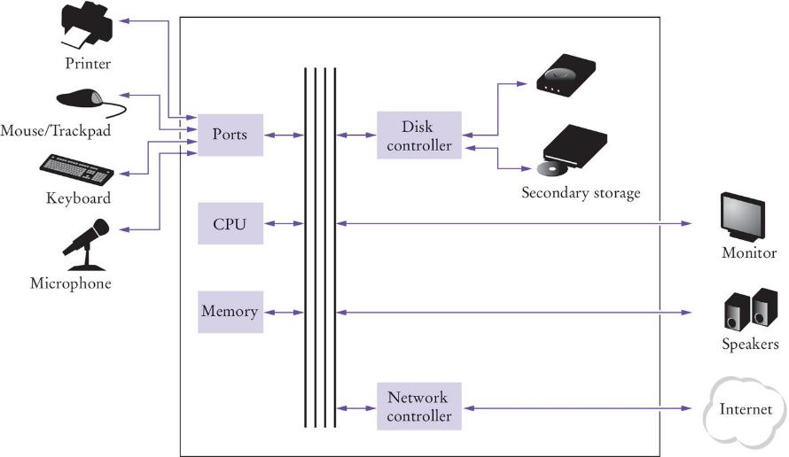
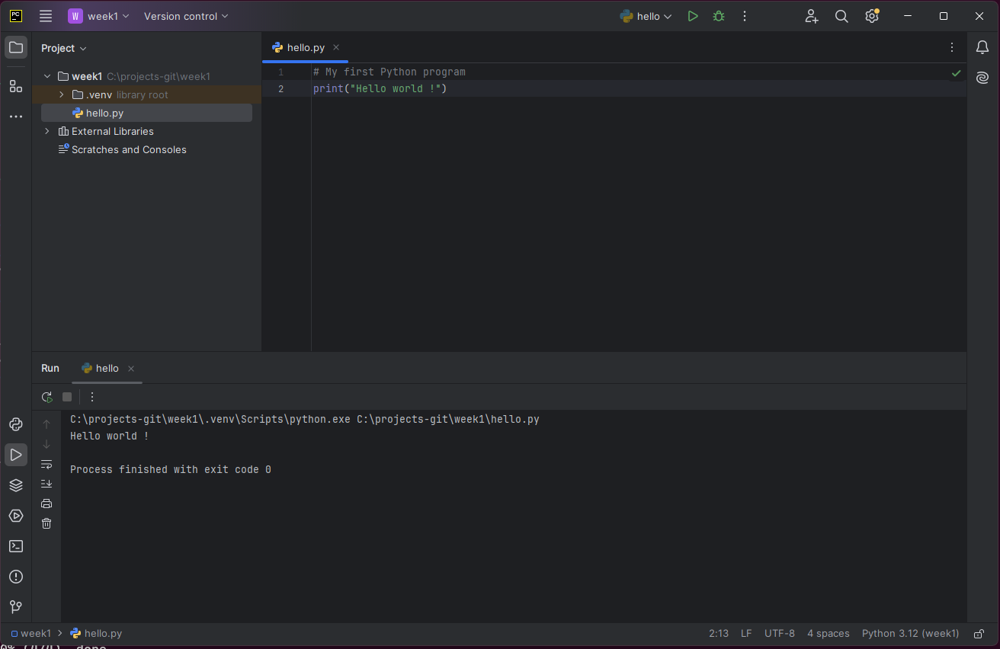
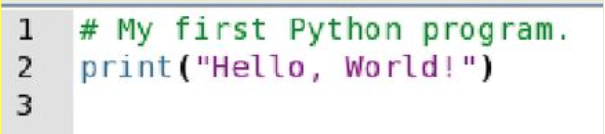
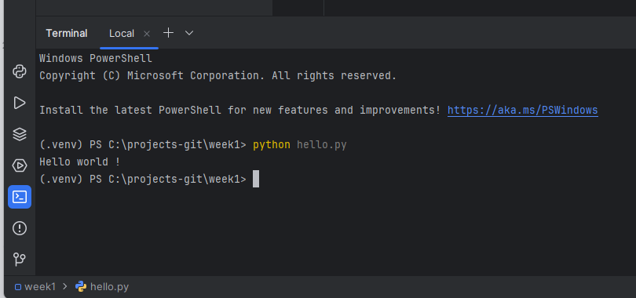
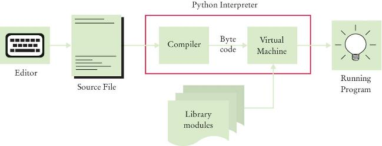
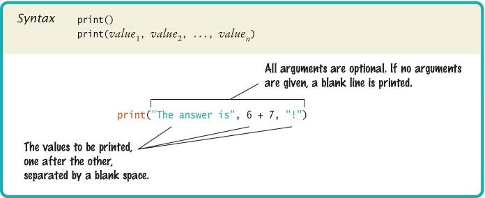

# Chapter One: Introduction

Hardware and software, how **algorithms** and **pseudocode** connect to programs, your **first Python** program, and how to read **syntax**, **run-time**, and **logic** issues.

[← Back to Course Index](../table-of-contents.md)

---

## Chapter Goals

In this chapter you will **learn**:

- How **hardware** fits together (CPU, RAM, and **persistent** secondary storage such as SSDs and cloud-synced files)
- How **algorithms** and **pseudocode** support designing a program before you fight with syntax
- How to set up a **programming environment**, run a first **Python** script, and use **`print`**, strings, and functions
- How to tell **syntax errors**, **run-time exceptions** (tracebacks), and **logic errors** apart

---

## Computer Programs

A **computer program** tells a computer the sequence of steps needed to complete a specific task.

Key points about programs:

- The program consists of a very large number of primitive (simple) instructions
- Computers can carry out a wide range of tasks because they can execute different programs
- Each program is designed to direct the computer to work on a specific task

### Programming

**Programming** is the act of designing, implementing, and testing computer programs.

---

## Hardware and Software

The building blocks that make up a computer system can be divided into two main categories: **hardware** and **software**.

---

## Hardware

**Hardware** consists of the physical elements in a computer system.

### Visible Components

Some very visible examples include:

- The monitor
- The mouse
- External storage devices
- The keyboard

### Core Components

**The Central Processing Unit (CPU)** performs program control and data processing.

**Storage devices** include:

- **Memory (RAM)** - Primary storage
- **Secondary storage**:
  - Internal **solid-state drives (SSDs)** (and traditional **hard drives** in some machines)
  - **USB flash drives** and other external drives
  - **Cloud-synced** folders (for example Google Drive, Dropbox, OneDrive, iCloud Drive)—after you save, copies live on disk and/or on a service, so the data survives a restart; that is **persistent** storage, unlike **RAM**

**Input/Output devices** allow the user to interact with the computer:

- Mouse
- Keyboard
- Printer
- Screen
- And many others...



---

## The CPU

The CPU has two main components:

### 1. The Control Unit

The **control unit** directs operation of the processor:

- All computer resources are managed by the control unit
- It controls communication and coordination between input/output devices
- It reads and interprets instructions and determines the sequence for processing the data
- It provides timing and control signals

### 2. The Arithmetic Logic Unit (ALU)

The **arithmetic logic unit** contains the circuitry to:

- Perform calculations
- Do comparisons

It is the workhorse portion of the computer and its job is to do precisely what the control unit tells it to do.

---

## Storage

There are two types of storage in a computer system:

### Primary Storage

- Composed of memory chips: electronic circuits that can store data as long as it is provided electric power
- Also known as RAM (Random Access Memory)
- Very fast but volatile (data is lost when power is turned off)

### Secondary Storage

- Provides slower, less expensive storage that is **persistent**: the data persists without electric power
- Examples: **SSDs**, traditional hard drives, USB flash drives, and **cloud-synced** files that have been saved to disk or to a network service—all **persistent** compared to **RAM**

### How Programs and Data are Stored

- Computers store both data and programs
- The data and program are located in secondary storage
- When a program is executed, it is loaded into memory (primary storage) where the CPU can access it quickly

---

## Memory

### Understanding Memory Structure

A simple way to envision primary memory is a table of cells:

- All cells are the same size (one byte)
- Each cell contains a unique address beginning with 0
- The CPU can read from or write to any cell by its address

### Memory Capacity

The "typical" computer has a main memory ranging from 4 gigabytes (GB) to 32 GB.

### Understanding Memory Sizes

How big is a gigabyte? Let's break it down:

- **A bit** is the smallest unit (0 or 1)
- **A byte** is 8 bits
- **A kilobyte (KB)** is 1,024 bytes, or "about 1 thousand bytes"
- **A megabyte (MB)** is 1,048,576 bytes, or "about 1 million bytes"
- **A gigabyte (GB)** is 1,073,741,824 bytes, or "about 1 billion bytes"

> **Note:** Computer scientists use powers of 2 (binary), so 1 KB = 2^10 = 1,024 bytes, not exactly 1,000 bytes.

---

## Executing a Program

Here's what happens when a program runs:

1. **Storage**: Program instructions and data (such as text, numbers, audio, or video) are stored in digital format

2. **Loading**: When a program is started, it is brought into memory, where the CPU can read it

3. **Execution**: The CPU runs the program one instruction at a time

4. **Interaction**: The program may react to user input

5. **Processing**: The instructions and user input guide the program execution

6. **Output**: The CPU reads data (including user input), modifies it, and writes it back to:
   - Memory
   - The screen
   - Secondary storage

---

## Software

**Software** is a sequence of instructions and decisions implemented in some language and translated to a form that can be executed or run on the computer.

### Examples of Software

- **Application programs**: Microsoft Word, web browsers, games
- **System software**: Operating systems (Windows, macOS, Linux)
- **Device drivers**: Software that allows hardware to communicate with the operating system

### How Software Works

- Software is typically realized as an application program
- Computers execute very basic instructions in rapid succession
- The basic instructions can be grouped together to perform complex tasks
- **Programming** is the act of designing and implementing computer programs

---

## Algorithms

This section is about **algorithms** and **pseudocode**: the plan behind a program, written before (or alongside) real code.

### What is an algorithm?

An **algorithm** is a step-by-step description of how to solve a problem.

Think of an algorithm as a recipe: clear, sequential instructions that anyone (or any computer) can follow to reach a specific goal.

### Programs and plans

A **program** is what you give the computer: instructions in a real language (here, Python). An **algorithm** is the underlying **plan**—the ordered steps that solve the task. The order matters: “turn on the kettle, then pour water” is not the same as the reverse.

For small exercises you can sometimes code immediately. As soon as a problem has choices (`if`), repetition (`while` / `for`), or several pieces of data, it pays to write the plan first and the program second. That habit saves time when something goes wrong, because you can check whether the _logic_ is wrong or only the _syntax_.

### What “good steps” look like

Think in terms of **inputs** (what you know at the start), **outputs** (what you must produce), and **state** (values you update as you go, such as a running total or a count). Each step should name a single action: “add 1 to `year`” is clearer than “handle the next year.”

A solid algorithm is usually described as:

- **Unambiguous** — anyone following the steps gets the same interpretation; there is no “you know what I mean” hidden in a step.
- **Executable** — every step is something a person or machine can actually do with the information available (no “just solve it”).
- **Terminating** — the process reaches a defined stop and an answer, except when the problem itself is meant to run without end (for example, an interactive app waiting for input).

If a plan is vague or impossible to carry out, fixing the program later will not help; fix the plan first.

### Pseudocode

**Pseudocode** is an informal but structured sketch of an algorithm. It is **not** a programming language: nothing runs it. You mix short English phrases with indentation and familiar keywords such as `If`, `Else`, `While`, and `For`. Indentation shows what belongs inside a branch or a loop.

Pseudocode is useful because it lets you agree with yourself (or a teammate) on **control flow**—what happens, in what order, under which conditions—before you worry about quotes, parentheses, and function names in Python.

**Conventions** (you can adapt these, but stay consistent):

- Use `Read` / `Set` / `Display` (or `Print`) for basic actions.
- Indent the body of each `If` / `Else` / `While` / `For`.
- Stop when the plan is detailed enough that turning it into code is mostly translation, not invention.

### Example: a two-way choice

Show the larger of two numbers:

```pseudocode
Read A
Read B
If A > B:
    Display A
Else:
    Display B
```

### Example: a loop with a condition

Read numbers until the user enters `0`, then print the sum of all numbers **except** the final zero:

```pseudocode
Set total to 0
Read n
While n is not equal to 0:
    Add n to total
    Read n
Display total
```

Notice how the `While` line states the condition under which you keep going, and the steps inside the loop update both `total` and the next value of `n`.

### Using this in the course

For assignments and projects, write pseudocode (or a numbered step list with the same level of detail) whenever the solution branches, repeats, or uses more than a couple of variables. Hand it in or keep it in your notes alongside the code: it makes feedback easier and mirrors how professional developers clarify design before implementation.

When the flow is more than a line or two, sketch it in pseudocode, then code.

---

## The Python Language

### History

Python was created by **Guido van Rossum**, a Dutch programmer, who began working on it in December 1989 as a Christmas holiday project. The first version was released in 1991.

**The Name "Python"**: Contrary to popular belief, Python is not named after the snake! Van Rossum was a fan of the British comedy group **Monty Python's Flying Circus**, and he wanted a name that was short, unique, and slightly mysterious.

### Why Python Was Created

Van Rossum was working at the **Centrum Wiskunde & Informatica (CWI)** in the Netherlands when he became frustrated with the limitations of existing programming languages. He wanted a language that would be **easy to read and write**, have a **simple and consistent syntax**, be **powerful enough** for real-world applications, and allow **rapid development**.

Python follows a design philosophy emphasizing **readability** and **simplicity**. The language's guiding principles (known as "The Zen of Python") prioritize code that is easy to read, understand, and maintain.

### Key Features

Python has become popular because of several key features:

- **Simple and clean syntax**: Much simpler than Java, C, and C++ (making it easier to learn)
- **Interpreted workflow**: You write a `.py` file and run it—there is **no separate compile command** the way there often is in C or C++
- **High-level language**: Handles memory management and low-level details automatically
- **Dynamically typed**: No need to declare variable types
- **Extensive standard library**: "Batteries included" philosophy—many tools built-in
- **Cross-platform**: Runs on Windows, macOS, Linux, and more
- **Large ecosystem**: Thousands of third-party packages available via PyPI (Python Package Index)
- **Great community**: Active, helpful community with extensive documentation

That “no compile step” idea refers to **what you do**: you do not manually build a binary before each run. Python still **translates your source to bytecode inside the interpreter** and runs that on the **Python Virtual Machine**—so “interpreted” and “**bytecode compiler** (part of the interpreter) → bytecode → VM” describe the same pipeline from two angles.

### Python's Popularity Today

Python is consistently ranked among the top programming languages because it's used for:

- **Web development** (Django, Flask)
- **Data science and machine learning** (NumPy, Pandas, TensorFlow, PyTorch)
- **Scientific computing** (SciPy, Matplotlib)
- **Automation and scripting**
- **Game development** (Pygame)
- **Desktop applications**
- **And much more!**

From day to day you run the **interpreter** on your source file; under the hood it compiles to bytecode and executes that, which is why both “run immediately” and “bytecode + VM” show up in books and documentation.

> **Optional reading** (explore on your own—not required for the first session)
>
> - **The Zen of Python** — In interactive Python, run `import this` to print the short aphorisms behind Python’s readability-focused design (the “Zen” mentioned above).
> - **Official tutorial** — The Python documentation includes a gentle introduction for newcomers: [The Python Tutorial](https://docs.python.org/3/tutorial/).

---

## Programming Environments

There are several ways of creating a computer program:

1. **Using an Integrated Development Environment (IDE)**
   - Provides tools for writing, testing, and debugging code
   - Examples: PyCharm, Visual Studio Code, IDLE

2. **Using a text editor**
   - Simple text editors like Notepad, TextEdit, or vim
   - Requires running the program from a command line

**For this course, we will use PyCharm IDE throughout.**

---

## IDE Components

The source code editor in an IDE can help programming by:

- **Listing line numbers** of code (makes debugging easier)
- **Color-coding** lines of code (comments, keywords, text, etc.)
- **Auto-indenting** source code (maintains proper structure)
- **Output window** (shows program results and error messages)
- **Debugger** (helps find and fix errors in your code)

---

## The PyCharm IDE



PyCharm is a powerful IDE specifically designed for Python development, with features that make coding easier and more efficient.

---

## Your First Program

The traditional **"Hello World"** program in Python is often the first program students write.



### Important Notes

- We will examine this program in detail in the next section
- **Typing the program into your IDE would be good practice!**
- Be careful of spelling (e.g., `print` vs. `primt`)—a typo in the name is usually a **`NameError` when that line runs**, not a `SyntaxError`
- **Python is case sensitive** — `Print` is different from `print`; `Print(...)` is **not** bad grammar, so Python does not raise `SyntaxError`—it tries to call a function named `Print`, does not find one, and raises **`NameError`** (see [**Run-Time Errors (Exceptions)**](#run-time-errors-exceptions))

---

## Text Editor Programming



You can also use a simple text editor to write your source code.

Once saved as `Hello.py`, you can use a console window to **run** it (for example `python3 Hello.py`). Python prepares bytecode internally; you do not run a separate compile step first.

However, using an IDE like PyCharm is recommended for beginners as it provides helpful features and error checking.

---

## Organize Your Work

### File Organization

Your **source code** is stored in `.py` files. Here are some best practices:

1. **Create a folder for this course**
2. **Create one folder per program** inside the course folder
3. **A program can consist of several .py files** (as you'll learn later)
4. **Be sure you know where your IDE stores your files** - you need to be able to find your files!

### Backup Your Files

Always backup your work:

- To a USB flash drive
- To a network drive
- To cloud storage (Google Drive, Dropbox, etc.)

> **Pro Tip:** Use version control (like Git) to track changes and backup your code professionally.

---

## Python Interactive Mode

Python offers two ways to run code:

### 1. Script Mode

Like other languages, you can write/save a complete Python program in a file and let the interpreter execute the instructions all at once.

### 2. Interactive Mode

Alternatively, you can run instructions one at a time using **interactive mode**:

- It allows quick "test programs" to be written
- Interactive mode allows you to write Python statements directly in the console window
- Great for experimenting and learning

To start interactive mode, simply type `python` (or `python3`) in your terminal/command prompt.

---

## Source Code to a Running Program

You still only **run** your program (no manual compile like in many C workflows). Internally, a typical run looks like this:

1. **Bytecode compilation** (part of the interpreter) reads your source and generates **bytecode**—compact instructions for the **Python Virtual Machine (PVM)**

2. **The PVM** executes that bytecode (in the same way your CPU executes machine instructions, but at a higher level)

3. **Libraries** (e.g., for drawing graphics) are automatically located and included when needed



---

## Let's Get Started!

### Your First Steps

1. **Open the PyCharm IDE** on your lab computer
2. **We are going to start simple** - as we learn more about Python, we'll use additional features in PyCharm
3. **Follow along** with the examples in this chapter

---

## "Hello World"

### Your First Python Program

Type the following into the Editor:

```python
# My first Python program
print("Hello World!")
```

**Save your file as `hello.py`**

### Important Reminders

- **Python is case sensitive** - you must be careful about distinguishing between upper and lowercase letters
- You have to enter the upper and lower case letters exactly as they appear above
- The `#` symbol starts a comment (we'll learn more about this)

---

## Analyzing Your First Program

A Python program contains one or more lines of instructions (statements) that will be translated and executed by the interpreter.

```python
# My first Python program
print("Hello World!")
```

### Breaking Down the Program

**Line 1:** `# My first Python program`

- This is a **comment** - a statement that provides descriptive information about the program to programmers
- Comments are ignored by Python when the program runs
- They help humans understand what the code does

**Line 2:** `print("Hello World!")`

- This line contains a **statement** that prints a line of text onscreen: "Hello World!"
- `print()` is a built-in Python function
- `"Hello World!"` is a string (text enclosed in quotes)

---

## Basic Python Syntax: Print

### Using the Python `print()` Function

A **function** is a collection of programming instructions that carry out a particular task (in this case, to print a value onscreen).

**It's code that somebody else wrote for you!** Python provides many built-in functions like `print()` that you can use without having to write them yourself.



---

## Syntax for Python Functions

### How to Call a Function

To use, or **call**, a function in Python you need to specify:

1. **The name of the function** that you want to use (in the previous example, the name was `print`)
2. **Any values (arguments)** needed by the function to carry out its task (in this case, `"Hello World!"`)

### Function Syntax

- Arguments are enclosed in **parentheses**: `print(...)`
- Multiple arguments are separated with **commas**: `print("Hello", "World")`
- A sequence of characters enclosed in quotation marks is called a **string**

---

## More Examples of the print Function

### Example 1: Printing Numerical Values

```python
print(3 + 4)
```

**Output:** `7`

This evaluates the expression `3 + 4` and displays the result.

### Example 2: Passing Multiple Values

```python
print("the answer is", 6 * 7)
```

**Output:** `the answer is 42`

Each value passed to the function is displayed, one after another, with a blank space after each value.

### Example 3: Multiple Print Statements

```python
print("Hello")
print("World!")
```

**Output:**

```
Hello
World!
```

By default, the `print()` function starts a new line after its arguments are printed.

---

## Our Second Program (printtest.py)

Here's a sample program that demonstrates various uses of the `print()` function:

```python
##
#  Sample Program that demonstrates the print function
#

#  Prints 7
print(3 + 4)

#  Print Hello World! on two lines
print("Hello")
print("World!")

#  Print multiple values with a single print function call
print("My favorite numbers are", 3 + 4, "and", 3 + 10)

#  Print with an empty line
print("Goodbye")
print()
print("Hope to see you again")
```

### Expected Output

```
7
Hello
World!
My favorite numbers are 7 and 13
Goodbye

Hope to see you again
```

> **Note:** There's a syntax error in the original code (`"and" 3 + 10` should be `"and", 3 + 10`). The corrected version is shown above.

---

## Errors

When something goes wrong, ask: did Python **reject the code before running it**, did the program **start and then stop with an error message**, or did it **finish but do the wrong thing**? In short: **syntax** (invalid code) vs **run-time exception** (crash with a traceback) vs **logic** (wrong answer or behavior, often with no crash).

There are three useful categories:

### 1. Syntax errors

These break the **grammar rules** of the language (missing punctuation, invalid layout, text where Python expects something else):

- **Punctuation and pairing**: missing commas, unmatched parentheses or quotation marks
- **Invalid layout**: code the parser cannot read as valid Python at all

A **wrong name**—whether `primt` or **`Print`** instead of `print`—usually produces a **`NameError` when that line runs**, not a `SyntaxError`, because Python treats it as an unknown name (see run-time errors below). That is **not** a grammar error: the line still parses.

**What happens:** Python reports a **`SyntaxError`** (or refuses to run the file) before it can execute the program normally. Fix the grammar, then run again.

### 2. Run-time errors (exceptions)

The code is **syntactically valid**, but while **running**, Python hits an operation that cannot be completed. The program **stops** and prints a **traceback** (file, line, type of error).

Examples include **`ZeroDivisionError`**, **`TypeError`**, and using a name Python does not know (**`NameError`**, such as `Print` instead of `print`).

**What happens:** No syntax problem was reported (or only earlier lines ran); the failure appears **during execution**. Fix the cause (values, types, names) or guard the operation (for example, do not divide by zero).

### 3. Logic errors

The program **runs to the end** without raising an exception, but the **result is not what you wanted**—wrong values, wrong message, missing output, or the right answer for the wrong problem.

**What happens:** You must **trace the steps** (and use tests or print debugging) because Python will not point to a single “logic error” line the way it does for syntax and many exceptions.

---

## Syntax Errors

Syntax errors are detected **before** the program can run successfully. Here are some common examples.

> **Do not confuse with `Print`:** Capitalizing `print` as `Print` is **not** a grammar mistake—the line parses fine—so Python does not treat it as `SyntaxError`. At run time Python looks up the name `Print`, fails, and raises **`NameError`**. See [**Run-Time Errors (Exceptions)**](#run-time-errors-exceptions).

### Common Syntax Errors

**1. Leave out quotes around text:**

```python
print(Hello World!)
```

**Error:** `SyntaxError: invalid syntax`

**2. Mismatch quotes:**

```python
print("Hello World!')
```

**Error:** `SyntaxError: EOL while scanning string literal`

**3. Don't match brackets:**

```python
print('Hello'
```

**Error:** `SyntaxError: unexpected EOF while parsing`

### Practice

Type each example above in the PyCharm Python Shell window and observe what error messages are generated. This will help you recognize and fix errors in your own code.

---

## Run-Time Errors (Exceptions)

Run-time errors appear **while the program is executing**. Python stops and shows a traceback.

### Common Examples

**1. Wrong function name (valid as text, not a known name):**

```python
Print("Hello World!")
```

**Error:** `NameError: name 'Print' is not defined` — **not** a `SyntaxError`; the line is syntactically legal, but the name `Print` is not defined.

**2. Impossible numeric operation:**

```python
print(1/0)
```

**Error:** `ZeroDivisionError: division by zero`

**3. Misspelled call name:**

```python
primt("Hello")
```

**Error:** `NameError: name 'primt' is not defined`

### Practice

Type each example above in the PyCharm Python Shell window and read the **traceback**: the bottom line states the exception type; the lines above show where execution stopped.

---

## Logic Errors

Logic errors are trickier because the program **finishes without an exception**, but the **output or behavior is wrong**.

### Common Logic Errors

**1. Misspell output:**

```python
print("Hello, Word!")  # Should be "World!"
```

**Output:** `Hello, Word!` (no error, but wrong output)

**2. Forget to output:**
If you remove the print statement, the program runs but produces no output.

### Practice

Run the examples above and notice: there is **no traceback**—the bug is in what you **asked** the program to do, not in Python’s ability to run the statements.

---

## Summary: Computer Basics

- **Computers** rapidly execute very simple instructions
- A **Program** is a sequence of instructions and decisions
- **Programming** is the art (and science) of designing, implementing, and testing computer programs
- The **Central Processing Unit (CPU)** performs program control and data processing
- **Storage devices** include **RAM** (fast, volatile) and **secondary storage** (slower, persistent)—for example an **SSD**, a USB drive, or **cloud-synced** files once saved

---

## Summary: Python

- **Python** was designed to be easier to read and learn than many languages such as Java, C, and C++, with simpler **syntax**
- You run **source code** directly; the **interpreter** includes a **bytecode compiler** and a **virtual machine**—there is **no separate compile command** like in typical C workflows
- Set aside time to learn your **programming environment** (for example **PyCharm**) so you can focus on the language during exercises
- An **editor** is a program for entering and modifying text, such as a Python program
- **Optional reading** in this chapter: **`import this`** (the Zen of Python) and the official **[Python Tutorial](https://docs.python.org/3/tutorial/)**

---

## Summary: Python Syntax

- **Python is case sensitive** - you must be careful about distinguishing between upper and lowercase letters
- You run source code directly; the **interpreter** includes a **bytecode compiler** that turns your source into bytecode, then the **virtual machine** runs that bytecode (you do not run a separate compile command)
- A **function** is called by specifying the function's name and its parameters
- A **string** is a sequence of characters enclosed in quotation marks

---

## Summary: Algorithms, Errors, and Pseudocode

- A **program** carries out an **algorithm**; **pseudocode** is an informal sketch of steps and control flow before you write Python
- An **algorithm** is a sequence of steps that is **unambiguous**, **executable**, and **terminating** (unless endless behavior is intended)
- **Pseudocode** uses indentation and words like `If` / `While`; it is not executed—it is a plan you refine, then translate to code
- A **syntax error** breaks Python’s grammar; Python reports it (often as `SyntaxError`) **before** the program can run normally
- A **run-time error** (**exception**) means the line is syntactically legal but an operation fails while running; Python stops with a **traceback** (for example **`NameError`** for `Print` instead of `print`, or **`ZeroDivisionError`**)
- A **logic error** means the program finishes **without** an exception, but the **result or behavior is wrong**—you must trace what you asked the program to do

---

## Key Takeaways

1. **Hardware** runs **software**; **RAM** is fast and volatile, **secondary storage** (SSD, USB, cloud-synced files once saved) persists your work
2. **Algorithms** and **pseudocode** are planning tools; a **program** (here, in **Python**) carries out the plan
3. **Python** is run by an **interpreter** that prepares **bytecode** for a **virtual machine**—you run `.py` files directly, without a separate compile step
4. **Practice** is essential: type the examples, break them on purpose, and read **tracebacks** for **exceptions**
5. **Three kinds of trouble:** **syntax** (grammar), **run-time exceptions** (crash + traceback, including `NameError` for `Print`), and **logic** (wrong output, no crash)

---

## Exercises

Practice what you've learned by completing the exercises:

**[→ Chapter 1 Exercises](excercises.md)**

---

*End of Chapter One*

[← Back to Course Index](../table-of-contents.md)
