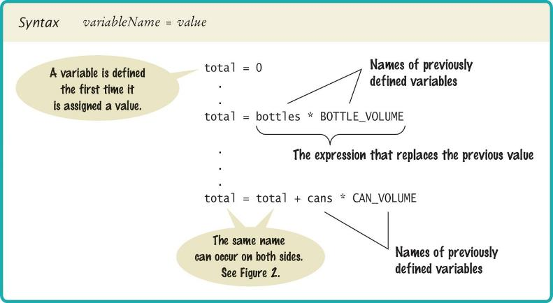
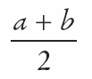
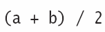
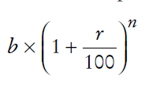
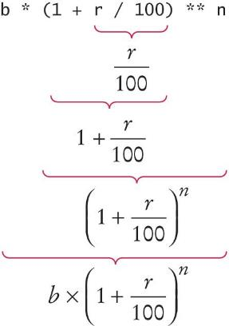
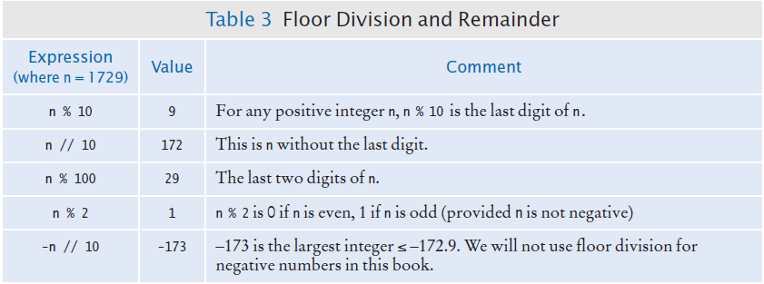

# Chapter Two: Programming with Numbers and Strings

---

## Introduction

Numbers and character strings are important data types in any Python program.

These are the fundamental building blocks we use to build more complex data structures.

In this chapter, you will learn how to work with numbers and text. We will write several simple programs that use them. You will also learn about Python's standard library — the modules that come bundled with Python — and how to import functions from them.

---

## Chapter Goals

In this chapter you will learn:

- To declare and initialize variables and constants
- To understand the properties and limitations of integers and floating-point numbers
- To appreciate the importance of comments and good code layout
- To write arithmetic expressions and assignment statements
- To **work a problem by hand before coding it**, and translate hand steps into Python operators
- To create programs that read and process inputs, and display formatted results
- To learn how to use Python strings — indexing, slicing, and methods
- To use Python's **standard library** modules (such as `math`) by importing functions into your program

---

## Chapter Contents

- **2.1 Variables** — Naming, assignment, types, constants, and comments
- **2.2 Arithmetic** — Operators, precedence, floor division, modulus, the `math` module, and type conversion
- **2.3 Problem Solving: First Do It By Hand** — Working an example by hand before writing code
- **2.4 Strings** — Length, concatenation, repetition, indexing, slicing, and methods
- **2.5 Input and Output** — Reading input with `input()` and formatting with f-strings

---

[← Back to Course Index](../table-of-contents.md)

## 2.1 Variables

### What is a Variable?

A **variable** is a named storage location in a computer program.

There are many different types of variables, each type used to store different things.

You **define** a variable by telling Python:

- What name you will use to refer to it
- The initial value of the variable

You use an **assignment statement** to place a value into a variable.

## Variable Definition

To define a variable, you must specify an initial value.

### The Assignment Statement

Use the **assignment statement** `=` to place a new value into a variable.

```python
pizzas = 3   # defines and initializes the variable pizzas
```

> **Important:** The `=` sign is **NOT** used for comparison. It copies the value on the right side into the variable on the left side. You will learn about the comparison operator in the next chapter.

## Assignment syntax

The value on the right of the '=' sign is assigned to the variable on the left



### Example: Pizza Party

**Problem:** You're ordering pizza for a party. Each pizza is cut into 8 slices and costs $12.99. If you order 3 pizzas for 4 people, how many slices does each person get, and how much does each person owe to split the bill evenly?

**Variables needed:**

- Number of pizzas ordered (whole number)
- Number of people at the party (whole number)
- Price of one pizza (number with fraction)

### Why Different Types?

There are three different types of data that we will use in this chapter:

- **Integer (int)**: A whole number (no fractional part) - `7`
- **Float**: A number with a fractional part - `8.88`
- **String**: A sequence of characters - `"Bob"`

> **Key Point:** The data type is associated with the **value**, not the **variable**:

```python
pizzas = 3            # int
pizza_price = 12.99   # float
```

#### Asking Python: the `type()` Function

If you're ever unsure what type a value or variable has, ask Python with the built-in `type()` function:

```python
print(type(6))         # <class 'int'>
print(type(12.0))      # <class 'float'>
print(type("Bob"))     # <class 'str'>
print(type(True))      # <class 'bool'>

pizzas = 3
print(type(pizzas))   # <class 'int'>

pizzas = 3.0
print(type(pizzas))   # <class 'float'>  ← the type follows the new value
```

Things to notice:

- `type(x)` returns the **class** of the value `x`. The output `<class 'int'>` simply means "this value's type is `int`".
- The same variable can show different types over time, because the type belongs to the **value** that's currently stored, not to the variable name.
- `type()` is one of your best **debugging tools**. When a calculation produces a surprising result or a `TypeError`, drop in `print(type(some_variable))` to see what Python actually has.

### Updating a Variable (Assigning a Value)

If an existing variable is assigned a new value, that value **replaces** the previous contents of the variable.

**Example:**

```python
pizzas = 3
pizzas = 5  # The value 3 is replaced with 5
```

### Updating a Variable (Computed)

**Executing the Assignment:**

```python
pizzas = pizzas + 2
```

**Step by Step:**

1. **Step 1:** Calculate the right-hand side of the assignment. Find the value of `pizzas`, and add 2 to it.
2. **Step 2:** Store the result in the variable named on the left side of the assignment operator.

#### Augmented Assignment Operators

Self-updates like `x = x + 2` are so common that Python provides shorter **augmented assignment** operators:

| Operator | Equivalent to | Example              |
| -------- | ------------- | -------------------- |
| `+=`     | `x = x + n`   | `pizzas += 2`        |
| `-=`     | `x = x - n`   | `count -= 1`         |
| `*=`     | `x = x * n`   | `total *= 1.05`      |
| `/=`     | `x = x / n`   | `price /= 2`         |
| `//=`    | `x = x // n`  | `pages //= 10`       |
| `%=`     | `x = x % n`   | `index %= length`    |
| `**=`    | `x = x ** n`  | `value **= 2`        |

```python
pizzas = 3
pizzas += 2   # pizzas is now 5
```

#### Multiple Assignment

You can assign several variables in a single statement:

```python
x, y = 10, 20            # x is 10, y is 20
first_name, last_name = "Harry", "Morgan"
a = b = c = 0            # a, b, and c are all 0
```

This is also the cleanest way to **swap** two variables:

```python
x, y = y, x   # swap values without a temporary variable
```

### ⚠️ A Warning About Variable Types

Since the data type is associated with the **value** and not the **variable**, a variable can be assigned different types at different places in a program:

```python
tax_rate = 5              # an int
# ... later in the program ...
tax_rate = 5.5            # a float
# ... and then ...
tax_rate = "Non-taxable"  # a string
```

> **Warning:** If you use a variable and it has an unexpected type, an error will occur in your program. It's best practice to keep the same type for a variable throughout your program.

### Our First Program: Type Testing

**Instructions:**

1. Open PyCharm (our IDE) and create a new file
2. Type in the following code
3. Save the file as `typetest.py`
4. Run the program

```python
# Testing different types in the same variable
tax_rate = 5  # int
print(tax_rate, type(tax_rate))

tax_rate = 5.5  # float
print(tax_rate, type(tax_rate))

tax_rate = "Non-taxable"  # string
print(tax_rate, type(tax_rate))

print(tax_rate + 5)  # This will cause an error!
```

> **Note:** Once you have initialized a variable with a value of a particular type, you should take great care to keep storing values of the same type in the variable. The last line will cause a `TypeError` because you cannot add a number to a string.

### A Minor Change

**Try this:** Change the last line to read:

```python
print(tax_rate + "??")
```

Save your changes and run the program.

**What is the result?**

When you use the `+` operator with strings, the second argument is **concatenated** (joined) to the end of the first. This works because both operands are strings.

We'll cover string operations in more detail later in this chapter.

## Table 1: Number Literals in Python

| Number    | Type    | Comment                                                                  |
| --------- | ------- | ------------------------------------------------------------------------ |
| `6`       | `int`   | An integer has no fractional part.                                       |
| `-6`      | `int`   | Integers can be negative.                                                |
| `0`       | `int`   | Zero is an integer.                                                      |
| `0.5`     | `float` | A floating-point number has a fractional part.                           |
| `1.0`     | `float` | A `float` even when the fractional part is zero — different from `1`.    |
| `1e3`     | `float` | Exponential (scientific) notation: `1 × 10³` = `1000.0`.                 |
| `2.5e-3`  | `float` | Negative exponent: `2.5 × 10⁻³` = `0.0025`.                              |
| `100_000` | `int`   | Underscores may be used as digit separators for readability.             |
| `3,000`   | error   | Do **not** use commas as thousands separators inside numeric literals.   |
| `3 1/2`   | error   | Mixed numbers are not allowed; use `3.5` or `7 / 2`.                     |

### Naming Variables

Variable names should describe the purpose of the variable. For example, `pizza_price` is better than `pp`.

**Rules for Variable Names:**

- Variable names must start with a letter or the underscore (`_`) character
- Continue with letters (upper or lower case), digits, or the underscore
- You cannot use other symbols (`?`, `%`, etc.) and spaces are not permitted
- Don't use **reserved** Python words (like `if`, `for`, `while`, `print`, etc.)
- Separate words by a **convention** — most languages have a preferred style for multi-word names

### `snake_case` vs `camelCase`

There are two common conventions for writing multi-word variable names:

| Style          | Example         | Where it's the convention                                  |
| -------------- | --------------- | ---------------------------------------------------------- |
| **snake_case** | `pizza_price`   | **Python (PEP 8)**, Ruby, Rust                             |
| **camelCase**  | `pizzaPrice`    | Java, JavaScript, TypeScript, C#, Swift                    |
| **PascalCase** | `PizzaPrice`    | Reserved in Python for **class names** only — not variables |

In Python, the official style guide ([PEP 8](https://peps.python.org/pep-0008/#function-and-variable-names)) recommends **`snake_case`**: lowercase letters with underscores between words. The Python standard library, the most popular third-party packages (`requests`, `numpy`, `pandas`, …), and most professional Python codebases all follow this convention.

```python
# ✅ Pythonic (snake_case) — preferred
pizzas = 3
pizza_price = 12.99
total_cost = pizzas * pizza_price

# ⚠️ Legal but non-Pythonic (camelCase)
numPizzas = 3
pizzaPrice = 12.99
totalCost = numPizzas * pizzaPrice
```

> **For this course, use `snake_case` for all variable and function names**, `UPPER_SNAKE_CASE` for constants, and `PascalCase` for class names (which we'll meet later). If you've seen `camelCase` in earlier slides or older Python textbooks, that's why — but `snake_case` is what real Python code uses.

## Table 2: Variable Names in Python

| Variable Name   | Comment                                                                      |
| --------------- | ---------------------------------------------------------------------------- |
| `pizza_price`     | ✅ Good — descriptive, `snake_case` (PEP 8).                               |
| `slices_per_pizza`| ✅ Good — multiple words separated by underscores.                         |
| `pp`              | ⚠️ Legal but cryptic — what does `pp` mean?                                |
| `pizzaPrice`      | ⚠️ Legal but non-Pythonic — `camelCase` is the convention in Java/JS, not Python. |
| `PizzaPrice`      | ⚠️ Legal but reserved by convention for **class names**, not variables.    |
| `_price`          | ✅ Legal — a single leading underscore signals "internal use".             |
| `4pizzas`         | ❌ Error — variable names cannot start with a digit.                       |
| `pizza price`     | ❌ Error — spaces are not allowed in identifiers.                          |
| `pizza-price`     | ❌ Error — `-` is the subtraction operator, not a name character.          |
| `if`            | ❌ Error — `if` is a reserved Python keyword.                                |
| `Print`         | ⚠️ Legal but confusing — Python is case-sensitive, so `Print` ≠ `print`.    |

### Programming Tip: Use Descriptive Variable Names

Choose descriptive variable names. Which variable name is more self-descriptive?

```python
pizza_price = 12.99   # Clear and descriptive
pp = 12.99            # Unclear — what does 'pp' mean?
```

This is particularly important when programs are written by more than one person.

### Constants

In Python, a **constant** is a variable whose value **should not** be changed after it's assigned an initial value.

It is a good practice to use **all caps** when naming constants:

```python
SLICES_PER_PIZZA = 8
```

It is good style to use named constants to explain numerical values to be used in calculations. Which is clearer?

```python
total_slices = pizzas * 8                    # What does 8 mean?
total_slices = pizzas * SLICES_PER_PIZZA     # Much clearer!
```

A programmer reading the first statement may not understand the significance of the "8".

> **Note:** Python will let you change the value of a constant, but just because you can do it, doesn't mean you should do it!

### Constants: Naming & Style

It is customary to use all **UPPER_CASE** letters for constants to distinguish them from variables. This provides a nice visual cue:

```python
SLICES_PER_PIZZA = 8   # Constant
MAX_SIZE = 100         # Constant
tax_rate = 5           # Variable
```

### Python Comments

Use comments at the beginning of each program, and to clarify details of the code.

Comments are:

- A courtesy to others
- A way to document your thinking
- Explanations for humans who read your code

The Python interpreter **ignores** comments when executing your program.

### Commenting Code: Style 1

```python
##
#  This program computes how many slices each person gets and how much
#  each person owes when splitting the bill at a pizza party.
#

# Number of slices in one pizza.
SLICES_PER_PIZZA = 8

# Price of one pizza, in dollars.
PIZZA_PRICE = 12.99

# Number of pizzas ordered.
pizzas = 3

# Number of people at the party.
people = 4

# Calculate the total number of slices and the total cost.
total_slices = pizzas * SLICES_PER_PIZZA
total_cost = pizzas * PIZZA_PRICE
print("Pizzas ordered:", pizzas, "(", total_slices, "slices, $", total_cost, ")")

# Calculate per-person numbers.
slices_per_person = total_slices / people
cost_per_person = total_cost / people
print("Each person gets", slices_per_person, "slices and owes $", cost_per_person)
```

### Commenting Code: Style 2

```python
##
#  This program computes how many slices each person gets and how much
#  each person owes when splitting the bill at a pizza party.
#

## CONSTANTS ##
SLICES_PER_PIZZA = 8     # Number of slices in one pizza
PIZZA_PRICE = 12.99      # Price of one pizza, in dollars

# Number of pizzas ordered.
pizzas = 3

# Number of people at the party.
people = 4

# Calculate the total number of slices and the total cost.
total_slices = pizzas * SLICES_PER_PIZZA
total_cost = pizzas * PIZZA_PRICE
print("Pizzas ordered:", pizzas, "(", total_slices, "slices, $", total_cost, ")")

# Calculate per-person numbers.
slices_per_person = total_slices / people
cost_per_person = total_cost / people
print("Each person gets", slices_per_person, "slices and owes $", cost_per_person)
```

### Multiline Comments

Unlike other programming languages such as JavaScript, Java, and C++ which use `/*...*/` for multi-line comments, there's no built-in mechanism for multi-line comments in Python.

**Option 1:** Insert a `#` for each line:

```python
# This is a comment
# written in more than
# just one line
```

**Option 2:** Use **docstrings** (triple quotes). Since Python will ignore string literals that are not assigned to a variable, you can add a multiline string and place your comment inside it:

```python
""" This is a comment written in more than just one line """
print("Hello, World!")
```

**Output:**

```
Hello, World!
```

### Undefined Variables

You must **define a variable before you use it** (i.e., it must be defined somewhere above the line of code where you first use the variable).

**❌ Incorrect order:**

```python
total_cost = pizzas * pizza_price   # Error! pizza_price not defined yet
pizza_price = 12.99
```

**✅ Correct order:**

```python
pizza_price = 12.99
total_cost = pizzas * pizza_price   # Now pizza_price is defined
```

## 2.2 Arithmetic

### Basic Arithmetic Operations

Python supports all of the basic arithmetic operations:

- **Addition**: `+`
- **Subtraction**: `-`
- **Multiplication**: `*`
- **Division**: `/`

You write your expressions similar to mathematics, but with Python syntax.





### Operator Precedence

Precedence is similar to Algebra, following **PEMDAS**:

1. **P**arentheses
2. **E**xponent
3. **M**ultiply/**D**ivide (left to right)
4. **A**dd/**S**ubtract (left to right)

### Mixing Numeric Types

If you mix integer and floating-point values in an arithmetic expression, the result is a **floating-point value**:

```python
7 + 4.0    # Yields the floating value 11.0
```

You can confirm this with `type()`:

```python
print(type(7 + 4))     # <class 'int'>    — int + int → int
print(type(7 + 4.0))   # <class 'float'>  — int + float → float
print(type(7 / 2))     # <class 'float'>  — / always returns a float
print(type(7 // 2))    # <class 'int'>    — // returns int when both sides are int
```

> **Remember:** If you mix **strings** with integer or floating-point values, the result is an error (unless you're using string concatenation with `+`).

### Powers (Exponentiation)

Double stars `**` are used to calculate an exponent:

```python
# Example: Calculate compound interest
# b * ((1 + r / 100) ** n)
result = b * ((1 + r / 100) ** n)
```





### Floor Division

When you divide two integers with the `/` operator, you get a **floating-point value**:

```python
7 / 4  # Yields 1.75
```

We can also perform **floor division** using the `//` operator. The `//` operator computes the quotient and **discards the fractional part**:

```python
7 // 4  # Evaluates to 1
```

This evaluates to `1` because 7 divided by 4 is 1.75, and the fractional part (0.75) is discarded.

### Calculating a Remainder (Modulus)

If you are interested in the **remainder** of dividing two integers, use the `%` operator (called **modulus**):

```python
remainder = 7 % 4  # The value of remainder will be 3
```

This is sometimes called **modulo division**.



### Calling Functions

Recall that a **function** is a collection of programming instructions that carry out a particular task.

The `print()` function can display information, but there are many other functions available in Python.

> **Important:** When calling a function, you must provide the correct number of arguments. The program will generate an error message if you don't.

### Calling Functions That Return a Value

Most functions **return a value**. That is, when the function completes its task, it passes a value back to the point where the function was called.

**Example:**

```python
abs(-173)  # Returns the value 173
```

The value returned by a function can be stored in a variable:

```python
distance = abs(x)
```

You can use a function call as an argument to the `print()` function:

```python
print(abs(-173))  # Prints 173
```

> **Try it:** Go to the Python shell window in PyCharm and type: `print(abs(-173))`

## Built-in Mathematical Functions

These functions are part of Python itself — no `import` needed.

| Function       | Description                                                  | Example                          |
| -------------- | ------------------------------------------------------------ | -------------------------------- |
| `abs(x)`       | Absolute value of `x`                                        | `abs(-5)` → `5`                  |
| `round(x)`     | Round to the nearest integer (banker's rounding)             | `round(2.5)` → `2`               |
| `round(x, n)`  | Round to `n` decimal places                                  | `round(3.14159, 2)` → `3.14`     |
| `min(a, b, …)` | Smallest of the arguments                                    | `min(4, 2, 9)` → `2`             |
| `max(a, b, …)` | Largest of the arguments                                     | `max(4, 2, 9)` → `9`             |
| `pow(x, n)`    | `x` raised to the power `n` (same as `x ** n`)               | `pow(2, 10)` → `1024`            |
| `int(x)`       | Convert to an integer (truncates toward zero)                | `int(3.9)` → `3`                 |
| `float(x)`     | Convert to a floating-point number                           | `float("1.5")` → `1.5`           |
| `str(x)`       | Convert to a string                                          | `str(42)` → `"42"`               |
| `len(s)`       | Length of a string (or other sequence)                       | `len("hello")` → `5`             |
| `type(x)`      | The class (type) of `x` — handy for debugging                | `type(3.14)` → `<class 'float'>` |

### Python Libraries (Modules)

A **library** is a collection of code, written by someone else, that is ready for you to use in your program.

A **standard library** is a library that is considered part of the language and must be included with any Python system.

Python's standard library is organized into **modules**. Related functions and data types are grouped into the same module.

Functions defined in a module must be **explicitly loaded** into your program before they can be used.

### Using Functions from the Math Module

For example, to use the `sqrt()` function, which computes the square root of its argument:

```python
# First include this statement at the top of your program file
from math import sqrt

# Then you can simply call the function as
y = sqrt(x)
```

### Other Ways to Import Modules

```python
from math import sqrt, sin, cos   # Imports only the functions listed
from math import *                # Imports all functions from the module (use with caution)
import math                       # Imports the module itself (all functions accessible via math.function_name)
```

**Key Differences:**

- `from math import sqrt, sin, cos` - Imports only the specified functions directly into your namespace. Call them as `sqrt(x)`, `sin(x)`, etc.

- `from math import *` - Imports ALL functions from the module directly into your namespace. Call them as `sqrt(x)`, `sin(x)`, etc. (Not recommended - can cause naming conflicts)

- `import math` - Imports the module object itself. All functions are accessible, but you must use the module name prefix. Call them as `math.sqrt(x)`, `math.sin(x)`, etc. (Recommended for clarity)

**Example:**

```python
y = math.sqrt(x)  # Note the 'math.' prefix when using 'import math'
```

### Built-in Functions

**Built-in functions** are a small set of functions that are defined as a part of the Python language. They can be used **without importing any modules**.

Examples: `print()`, `len()`, `abs()`, `int()`, `float()`, `str()`, `type()`, `input()`

## Functions from the `math` Module

Add `import math` (or `from math import …`) at the top of your file before using these.

| Function          | Description                                            | Example                              |
| ----------------- | ------------------------------------------------------ | ------------------------------------ |
| `math.sqrt(x)`    | Square root of `x` (`x ≥ 0`)                           | `math.sqrt(16)` → `4.0`              |
| `math.pow(x, y)`  | `x` raised to the power `y` (returns `float`)          | `math.pow(2, 8)` → `256.0`           |
| `math.exp(x)`     | `eˣ`                                                   | `math.exp(1)` → `2.718...`           |
| `math.log(x)`     | Natural logarithm of `x`                               | `math.log(math.e)` → `1.0`           |
| `math.log10(x)`   | Base-10 logarithm of `x`                               | `math.log10(1000)` → `3.0`           |
| `math.ceil(x)`    | Smallest integer ≥ `x`                                 | `math.ceil(2.1)` → `3`               |
| `math.floor(x)`   | Largest integer ≤ `x`                                  | `math.floor(2.9)` → `2`              |
| `math.sin(x)`     | Sine of `x` (in radians)                               | `math.sin(0)` → `0.0`                |
| `math.cos(x)`     | Cosine of `x` (in radians)                             | `math.cos(0)` → `1.0`                |
| `math.tan(x)`     | Tangent of `x` (in radians)                            | `math.tan(0)` → `0.0`                |
| `math.pi`         | Constant π ≈ `3.14159…`                                | `math.pi`                            |
| `math.e`          | Constant *e* ≈ `2.71828…`                              | `math.e`                             |

### Floating-Point to Integer Conversion

You can use the functions `int()` and `float()` to convert between integer and floating-point values:

```python
balance = total + tax   # balance: float
dollars = int(balance)  # dollars: integer
```

> **Note:** You lose the fractional part of the floating-point value (no rounding occurs). Use `round()` if you need rounding.

## Arithmetic Expressions

When translating math notation into Python, remember that everything must be on a single line, multiplication needs an explicit `*`, and grouping is done with `( )`.

| Mathematical expression | Python expression          | Notes                                            |
| ----------------------- | -------------------------- | ------------------------------------------------ |
| *a* + *b* / 2           | `a + b / 2`                | `/` has higher precedence than `+`               |
| (*a* + *b*) / 2         | `(a + b) / 2`              | Use parentheses to override precedence           |
| *a*² + *b*²             | `a ** 2 + b ** 2`          | `**` is exponentiation                           |
| 3*x*                    | `3 * x`                    | The `*` is required — `3x` is a syntax error     |
| √(*a*² + *b*²)          | `math.sqrt(a ** 2 + b ** 2)` | Requires `import math`                         |
| (1 + *r* / 100)ⁿ        | `(1 + r / 100) ** n`       | Compound-interest growth factor                  |
| ⌊*x* / *y*⌋             | `x // y`                   | Floor division                                   |
| *x* mod *y*             | `x % y`                    | Remainder (modulus)                              |

### Unbalanced Parentheses

**Consider the expression:**

```python
((a + b) * t / 2 * (1 - t)  # Missing closing parenthesis
```

**What is wrong with the expression?**

**Now consider this expression:**

```python
(a + b) * t) / (2 * (1 - t)  # Has 3 "(" and 3 ")", but still incorrect
```

This expression has three `(` and three `)`, but it still is not correct because the parentheses are not properly matched.

**Rules:**

- At any point in an expression, the count of `(` must be greater than or equal to the count of `)`
- At the end of the expression, the two counts must be the same

### Additional Programming Tips

**Use Spaces in Expressions:**

```python
total_cost = pizzas * PIZZA_PRICE  # Easier to read
```

Is easier to read than:

```python
total_cost=pizzas*PIZZA_PRICE  # Harder to read
```

---

## 2.3 Problem Solving: First Do It By Hand

Before you write any code, **work the problem by hand** with a small, concrete example. If you can't compute the answer with paper and a calculator, you certainly can't tell a computer how to do it.

### Why Solve It By Hand First?

- It forces you to discover the **steps** (the algorithm) before fighting with syntax.
- It produces an **expected answer** you can use to test your program.
- It exposes **edge cases** (zero, negatives, fractions, "what if the input is empty?") that look obvious on paper but are easy to miss in code.

### A Worked Example: Converting Pennies to Dollars and Cents

**Problem.** You have a whole number of **pennies** (U.S. cents). How many **whole dollars** is that, and how many **pennies are left over** after you peel off those full dollars?

**Step 1 — Pick concrete numbers.** Try **1729** pennies (the same total used in Section 2.2).

**Step 2 — Compute by hand.**

- One dollar is 100 pennies. **Whole dollars:** 1729 ÷ 100 = 17.29 → we only keep the whole part → **17 dollars**.
- **Leftover cents:** 1729 − 17 × 100 = **29 cents**. (That is the remainder after dividing by 100.)

**Step 3 — Translate each step to a Python operation.**

| Hand calculation                         | Python operation   |
| ---------------------------------------- | ------------------ |
| "How many full dollars fit in the pile?" | `pennies // 100`   |
| "How many cents are left after that?"      | `pennies % 100`    |

**Step 4 — Write the program from those steps.**

```python
##
#  This program converts a total number of pennies into whole dollars
#  and leftover cents, using floor division and the modulus operator.
#

pennies = 1729
dollars = pennies // 100
cents = pennies % 100
print(f"That is {dollars} dollars and {cents} cents")
```

**Step 5 — Test against your hand answer.** Run the program and enter `1729`. You should see **17 dollars and 29 cents**. If the program disagrees with your paper answer, **trust the paper answer** until you find the bug.

### A Checklist for Any New Problem

1. **Read the problem twice.** Underline the inputs, the outputs, and the units.
2. **Pick a small, concrete example** you can compute by hand.
3. **Write the steps** in plain English (or pseudocode).
4. **Map each step** to a Python operator, function, or library call.
5. **Code one step at a time** and print intermediate values.
6. **Compare the output to your hand answer.**

> **Programming tip.** When the program and your hand answer disagree, the bug is usually in step 3 or 4 (you skipped a step or chose the wrong operator), *not* in step 5.

---

## 2.4 Strings

### What is a String?

Start with some simple definitions:

- **Text** consists of **characters**
- **Characters** are letters, numbers, punctuation marks, spaces, etc.
- A **string** is a sequence of characters

In Python, string literals are specified by enclosing a sequence of characters within a matching pair of either **single** or **double quotes**:

```python
print("This is a string.", 'So is this.')
```

By allowing both types of delimiters, Python makes it easy to include an apostrophe or quotation mark within a string:

```python
message = 'He said "Hello"'
message2 = "It's a beautiful day"
```

> **Remember:** Use matching pairs of quotes - single with single, double with double.

### String Length

The number of characters in a string is called the **length** of the string. (For example, the length of `"Harry"` is 5).

You can compute the length of a string using Python's `len()` function:

```python
length = len("World!")  # length is 6
```

A string of length 0 is called the **empty string**. It contains no characters and is written as `""` or `''`.

### String Concatenation ("+")

You can 'add' one string onto the end of another using the `+` operator:

```python
first_name = "Harry"
last_name = "Morgan"
name = first_name + last_name  # Result: "HarryMorgan"
print("my name is:", name)
```

**You wanted a space in between the two names?**

```python
name = first_name + " " + last_name  # Result: "Harry Morgan"
```

Using `+` to concatenate strings is an example of a concept called **operator overloading**. The `+` operator performs different functions depending on the types of variables (addition for numbers, concatenation for strings).

### String Repetition ("\*")

You can also produce a string that is the result of repeating a string multiple times.

**Example:** Suppose you need to print a dashed line. Instead of specifying a literal string with 50 dashes, you can use the `*` operator:

```python
dashes = "-" * 50
```

This results in the string:

```
"-------------------------------------------------"
```

The `*` operator is also **overloaded** - it multiplies numbers but repeats strings.

### Converting Numbers to Strings

Use the `str()` function to convert numbers to strings:

```python
balance = 888.88
dollars = 888

balance_as_string = str(balance)   # "888.88"
dollars_as_string = str(dollars)   # "888"

print(balance_as_string)
print(dollars_as_string)
```

**To turn a string containing a number into a numerical value**, we use the `int()` and `float()` functions:

```python
id = int("1729")        # Converts to integer: 1729
price = float("17.29")  # Converts to float: 17.29

print(id)
print(price)
```

> **Important:** This conversion is essential when the strings come from **user input** (which we'll cover in section 2.5).

### Accessing Characters in a String

Each character inside a string has an **index number** (starting from 0):

**Example 1:**

```
| 0 | 1 | 2 | 3 | 4 | 5 | 6 | 7 | 8 | 9 |
| c | h | a | r | s |   | h | e | r | e |
```

**Example 2:**

```
| 0 | 1 | 2 | 3 | 4 |
| H | a | r | r | y |
```

**Key Points:**

- The first character is at index **zero (0)**
- The `[]` operator returns a character at a given index inside a string

**Example:**

```python
name = "Harry"
start = name[0]  # 'H'
last = name[4]   # 'y'
```

> **Watch out:** asking for an index that doesn't exist (e.g. `name[5]` for `"Harry"`) raises an `IndexError`.

### Negative Indexing

Python lets you count **backwards from the end** of a string by using negative indexes. `-1` is the last character, `-2` is the second-to-last, and so on:

```python
| -5 | -4 | -3 | -2 | -1 |
| H  | a  | r  | r  | y  |
|  0 |  1 |  2 |  3 |  4 |

name = "Harry"
last        = name[-1]  # 'y'
second_last = name[-2]  # 'r'
```

This is much cleaner than computing `name[len(name) - 1]`.

### String Slicing

A **slice** extracts a substring using the `[start:stop]` syntax. The slice includes the character at `start` but **stops before** `stop`:

```python
greeting = "Hello, World!"

greeting[0:5]    # "Hello"     — characters 0, 1, 2, 3, 4 (not 5!)
greeting[7:12]   # "World"
greeting[:5]     # "Hello"     — omitting start means "from the beginning"
greeting[7:]     # "World!"    — omitting stop means "to the end"
greeting[-6:-1]  # "World"     — slicing also works with negative indexes
greeting[:]      # "Hello, World!" — a full copy
```

You can also include a third value, the **step**:

```python
greeting[::2]    # "Hlo ol!"   — every second character
greeting[::-1]   # "!dlroW ,olleH" — the string reversed
```

> **Important:** strings in Python are **immutable** — slicing always returns a *new* string; the original is never changed. `greeting[0] = "h"` is an error.

## String Operations

The table below summarizes the operators that work on strings.

| Expression                | Result                | Description                                    |
| ------------------------- | --------------------- | ---------------------------------------------- |
| `"Harry" + "Morgan"`      | `"HarryMorgan"`       | Concatenation joins two strings                |
| `"ab" * 3`                | `"ababab"`            | Repetition repeats a string `n` times          |
| `len("Harry")`            | `5`                   | Number of characters                           |
| `"Harry"[0]`              | `"H"`                 | Character at index 0                           |
| `"Harry"[-1]`             | `"y"`                 | Last character (negative indexing)             |
| `"Harry"[1:4]`            | `"arr"`               | Slice from index 1 up to (not including) 4     |
| `"a" in "Harry"`          | `True`                | Membership test — is `"a"` a substring?        |
| `"z" in "Harry"`          | `False`               | Same, with no match                            |
| `"Harry" == "harry"`      | `False`               | Equality (case-sensitive)                      |
| `str(42) + " slices"`     | `"42 slices"`         | Use `str()` to convert numbers before joining  |

### Methods

In computer programming, an **object** is a software entity that represents a value with certain behavior.

- The value can be simple, such as a string, or complex, like a graphical window or data file
- The behavior of an object is given through its **methods**

A **method** is a collection of programming instructions to carry out a specific task – similar to a function, but:

- Unlike a **function**, which is a standalone operation, a **method** can only be applied to an object of the type for which it was defined
- Methods are specific to a type of object
- Functions are general and can accept arguments of different types

**Example:** You can apply the `upper()` method to any string:

```python
name = "John Smith"
uppercase_name = name.upper()  # Sets uppercase_name to "JOHN SMITH"
```

## Some Useful String Methods

Methods are called with the dot syntax: `some_string.method_name(arguments)`. Because strings are immutable, every method returns a **new** string instead of modifying the original.

| Method                          | Description                                            | Example                                  | Result            |
| ------------------------------- | ------------------------------------------------------ | ---------------------------------------- | ----------------- |
| `s.upper()`                     | All-uppercase copy                                     | `"hi".upper()`                           | `"HI"`            |
| `s.lower()`                     | All-lowercase copy                                     | `"HI".lower()`                           | `"hi"`            |
| `s.strip()`                     | Remove leading/trailing whitespace                     | `"  hi ".strip()`                        | `"hi"`            |
| `s.replace(old, new)`           | Replace every occurrence of `old` with `new`           | `"hi hi".replace("hi", "yo")`            | `"yo yo"`         |
| `s.find(sub)`                   | Index of first occurrence of `sub` (`-1` if missing)   | `"banana".find("na")`                    | `2`               |
| `s.count(sub)`                  | Number of non-overlapping occurrences                  | `"banana".count("na")`                   | `2`               |
| `s.startswith(prefix)`          | `True` if `s` begins with `prefix`                     | `"hello".startswith("he")`               | `True`            |
| `s.endswith(suffix)`            | `True` if `s` ends with `suffix`                       | `"hello".endswith("lo")`                 | `True`            |
| `s.split(sep)`                  | Split into a list around `sep` (default: whitespace)   | `"a,b,c".split(",")`                     | `["a", "b", "c"]` |
| `s.isdigit()`                   | `True` if every character is a digit                   | `"123".isdigit()`                        | `True`            |
| `s.isalpha()`                   | `True` if every character is a letter                  | `"abc".isalpha()`                        | `True`            |

You can also **chain** methods because each one returns a string:

```python
raw = "  Hello, World!  \n"
clean = raw.strip().lower().replace(",", "")
print(clean)   # "hello world!"
```

### String Escape Sequences

Some characters are inconvenient (or impossible) to type directly inside a string literal — quotes, backslashes, tabs, newlines. Python lets you write them with **escape sequences** that begin with `\`.

| Escape | Meaning                          |
| ------ | -------------------------------- |
| `\"`   | Double quote                     |
| `\'`   | Single quote                     |
| `\\`   | A single literal backslash       |
| `\n`   | Newline (line break)             |
| `\t`   | Tab                              |
| `\r`   | Carriage return                  |

**Printing a double quote** inside a double-quoted string — escape it with `\`:

```python
print("He said \"Hello\"")
# Output: He said "Hello"
```

**Printing a backslash** — escape it with another backslash. Watch what happens with a Windows-style path:

```python
print("C:\temp\secret.txt")    # WRONG: \t becomes a tab character
# Output: C:    emp\secret.txt
#            ^ that gap is a real tab inserted by \t

print("C:\\temp\\secret.txt")  # CORRECT: \\ is a literal backslash
# Output: C:\temp\secret.txt
```

**Why?** Python interpreted `\t` in the first example as a **tab character** (a valid escape sequence). To print a literal backslash, use `\\`.

> **Rule of thumb:** when you need a literal backslash — especially in Windows file paths or regular expressions — use `\\`, or use a **raw string** (next).

**Raw strings.** Prefixing a string literal with `r` turns off escape processing entirely. This is the cleanest way to write Windows paths or regular expressions:

```python
print(r"C:\temp\secret.txt")
# Output: C:\temp\secret.txt
```

**Newline example.** Use `\n` inside a string to break lines:

```python
print("*\n**\n***")
```

**Output:**

```
*
**
***
```

## 2.5 Input and Output

### Reading Input from the User

You can read a string from the console with the `input()` function:

```python
name = input("Please enter your name: ")
```

**Converting a string to a number:**

If numeric (rather than string) input is needed, you can convert it:

```python
age = int(input("Please enter age: "))
```

The above is equivalent to doing it in two steps:

```python
text = input("Please enter age: ")  # String input
age = int(text)                     # Converted to int
```

### String Formatting in Python

**Why Format Strings?**

- To create readable and meaningful output
- Combine text and variables dynamically
- Control the appearance of numeric values (e.g., decimals, alignment)

**Three Main Methods of String Formatting:**

1. Old `%` Operator (Legacy) - Not recommended for new code
2. `.format()` Method
3. **f-strings** (Modern and Recommended)

#### The Old % Operator

Uses `%` for placeholders:

- `%s` for strings
- `%d` for integers
- `%.2f` for floating-point numbers (2 decimal places)

**Example:**

```python
price_per_slice = 1.6234
print("Price per slice: %.2f" % price_per_slice)  # Output: Price per slice: 1.62
```

#### The .format() Method

Use `{}` as placeholders in the string. Supports positional and named arguments:

```python
price_per_slice = 1.6234
print("Price per slice: {:.2f}".format(price_per_slice))  # Output: Price per slice: 1.62

# Positional Arguments
print("{} is {} years old.".format("Alice", 25))  # Output: Alice is 25 years old.

# Named Arguments
print("{name} is {age} years old.".format(name="Alice", age=25))
```

#### f-strings (Formatted String Literals) - Recommended

Introduced in Python 3.6. Use `f""` to directly embed expressions inside curly braces:

```python
price_per_slice = 1.6234
print(f"Price per slice: {price_per_slice:.2f}")  # Output: Price per slice: 1.62

name = "Alice"
age = 25
print(f"{name} is {age} years old.")  # Output: Alice is 25 years old.
```

> **Recommendation:** Use f-strings for new code - they're the most readable and efficient.

### Example Program: `pizza_party.py`

This example demonstrates input, processing, and formatted output. Save the code below as `pizza_party.py` and run it.

```python
##
#  This program prints how many slices each person gets and how much
#  each person owes when splitting the bill at a pizza party,
#  based on the user's input.
#

# Number of slices in one pizza.
SLICES_PER_PIZZA = 8

# Obtain the number of pizzas, the number of people, and the price per pizza.
user_input = input("How many pizzas did you order? ")
pizzas = int(user_input)

user_input = input("How many people are at the party? ")
people = int(user_input)

user_input = input("How much does one pizza cost? ")
pizza_price = float(user_input)

# Compute totals.
total_slices = pizzas * SLICES_PER_PIZZA
total_cost = pizzas * pizza_price

# Compute and print per-person numbers.
slices_per_person = total_slices / people
cost_per_person = total_cost / people
print(f"Each person gets {slices_per_person:5.2f} slices")
print(f"Each person owes ${cost_per_person:7.2f}")
```

> **Tip:** Inside an f-string, the format specifier comes after a colon. `{cost_per_person:7.2f}` means "right-aligned in a field of width 7, with 2 digits after the decimal point" — the same effect as `%7.2f`.

---

## Common Errors and Pitfalls

These are the bugs every Python beginner hits at least once. Recognize them early and you'll save hours of debugging.

### 1. Forgetting to Convert `input()` to a Number

`input()` always returns a **string**, even when the user types digits.

```python
age = input("Age: ")
print(age + 1)   # TypeError: can only concatenate str (not "int") to str
```

✅ Convert it explicitly:

```python
age = int(input("Age: "))
print(age + 1)
```

### 2. Floating-Point Precision Surprises

Floats are stored in binary and cannot represent every decimal exactly:

```python
print(0.1 + 0.2)   # 0.30000000000000004 — not 0.3!
```

For **money** or anything where exact decimals matter, work in cents (integers) or use the `decimal` module. For display, format with `f"{x:.2f}"`.

### 3. Confusing `=` with `==`

`=` is **assignment**; `==` is **comparison** (covered in Chapter 3). Writing `if x = 5:` is a `SyntaxError`.

### 4. Mixing Strings and Numbers with `+`

```python
"Total: " + 5         # TypeError
"Total: " + str(5)    # ✅ "Total: 5"
f"Total: {5}"         # ✅ even cleaner
```

> **Debugging tip.** When a `TypeError` like this surprises you, drop a quick `print(type(x))` before the failing line to see what type Python actually has. For example, `age` after `age = input("Age: ")` is `<class 'str'>`, not `<class 'int'>` — `type()` makes that obvious in one line.

### 5. Using a Variable Before It Is Defined

```python
print(total)          # NameError: name 'total' is not defined
total = 100
```

A variable must be assigned **before** any line that reads it.

### 6. Index Out of Range

```python
name = "Harry"
print(name[5])        # IndexError — valid indexes are 0..4 (or -5..-1)
```

Use `len(name)` to know the bounds, or use slicing (which never raises an `IndexError`).

### 7. Division Quirks

- `/` always returns a **float**: `4 / 2` is `2.0`, not `2`.
- `//` truncates toward **negative infinity**: `-7 // 2` is `-4`, not `-3`.
- Dividing by zero raises `ZeroDivisionError`. Always validate user input before dividing.

### 8. Backslashes in Windows Paths

```python
path = "C:\new\test"   # \n becomes a newline, \t becomes a tab
```

Use `\\`, forward slashes, or a **raw string**: `r"C:\new\test"`.

### 9. Accidental Reassignment of Built-ins

```python
list = [1, 2, 3]       # 'list' now hides the built-in list() type!
```

Avoid using names like `list`, `str`, `int`, `sum`, `id`, `input` for your own variables.

### 10. Indentation and Whitespace

Python uses indentation to group code. Mixing tabs and spaces, or indenting inconsistently, causes `IndentationError` or — worse — silent logic bugs. Pick one style (PyCharm uses 4 spaces by default) and stick with it.

---

## Chapter Summary

### Variables

- A **variable** is a storage location with a name
- When defining a variable, you must specify an initial value
- By convention, variable names should start with a lower case letter
- An assignment statement stores a new value in a variable, replacing the previously stored value

### Operators

- The assignment operator `=` does **not** denote mathematical equality
- Variables whose initial value should not change are typically capitalized by convention (constants)
- **Augmented assignments** like `+=`, `-=`, `*=`, `//=`, `%=` are shorthand for `x = x op y`
- **Multiple assignment** (`a, b = 1, 2`) makes value swaps trivial: `x, y = y, x`
- The `/` operator performs division yielding a value that may have a fractional value
- The `//` operator performs floor division - the remainder is discarded
- The `%` operator computes the remainder of a floor division (modulus)

### Problem Solving

- **Work the problem by hand first** with a small concrete example
- Translate each hand step into a Python operator or function before you start typing code
- Compare program output to your hand answer; trust the hand answer until you find the bug

### Python Functions and Modules

- The Python library declares many mathematical functions, such as `sqrt()` and `abs()`
- You can convert between integers, floats, and strings using: `int()`, `float()`, `str()`
- Use **`type(x)`** to ask Python what type a value or variable has — invaluable for debugging
- Python libraries are grouped into **modules**. Use the `import` statement to use functions from a module
- Use the `input()` function to read keyboard input in a console window
- Use format specifiers (f-strings recommended) to specify how values should be formatted

### Strings

- **Strings** are sequences of characters
- The `len()` function yields the number of characters in a string
- Use the `+` operator to **concatenate** strings, and `*` to **repeat** them
- To concatenate, the `+` operator requires both arguments to be strings — convert numbers with `str()`
- String index numbers are counted starting with **0**; **negative indexes** count from the end
- Use the `[]` operator to extract individual characters and `[start:stop]` slicing to extract substrings
- Strings are **immutable** — methods like `upper()`, `lower()`, `strip()`, `replace()`, `split()` return a *new* string
- Use **escape sequences** (`\n`, `\t`, `\\`, `\"`) or **raw strings** (`r"..."`) for special characters

---

## Key Takeaways

1. **Variables** store data and can change their values during program execution
2. **Constants** (UPPER_CASE) should not be changed after initialization
3. **Comments** help document your code for yourself and others
4. **Arithmetic operations** follow PEMDAS precedence rules
5. **Strings** are sequences of characters that can be manipulated with operators and methods
6. **Type conversion** is essential when working with user input
7. **f-strings** are the modern, recommended way to format output

---

_End of Chapter Two_

[← Back to Course Index](../table-of-contents.md)
