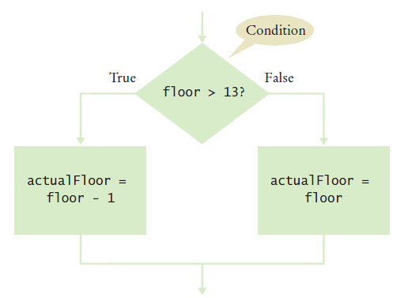
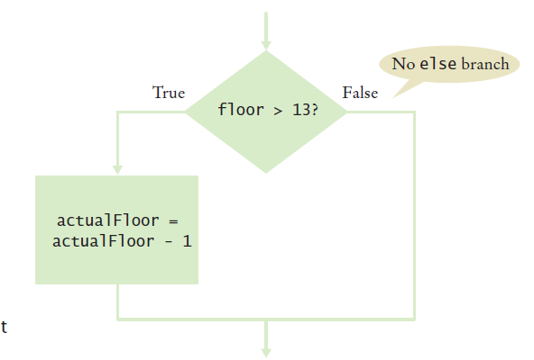
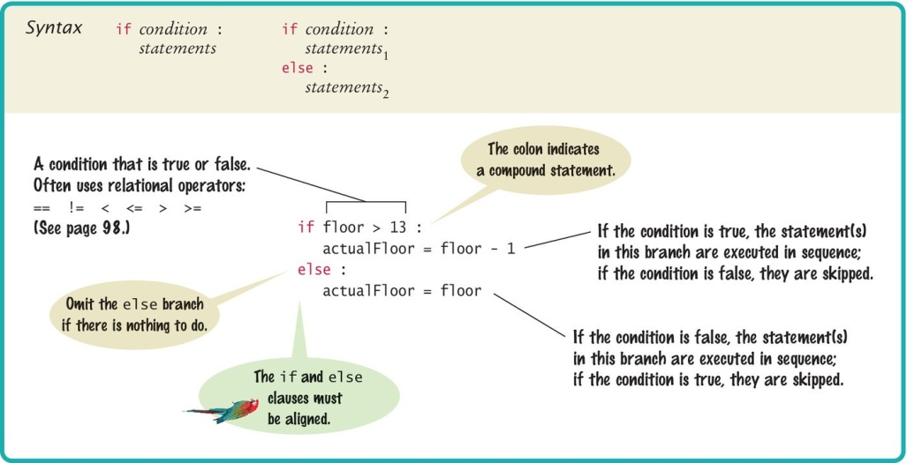
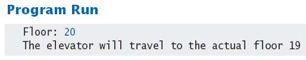
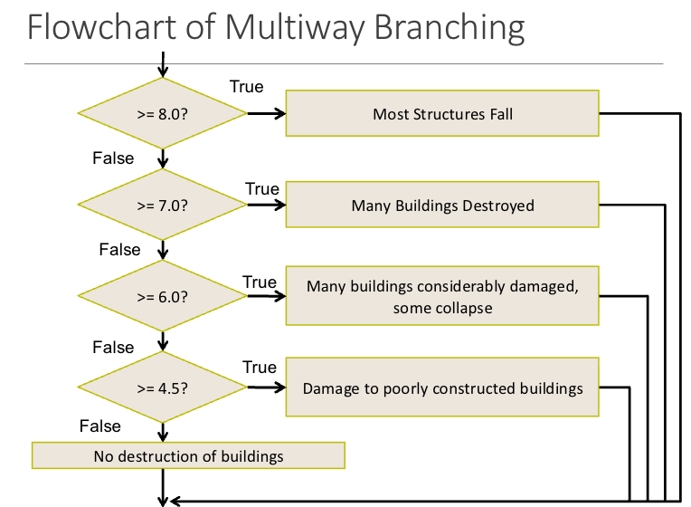
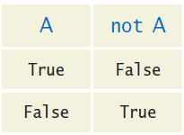
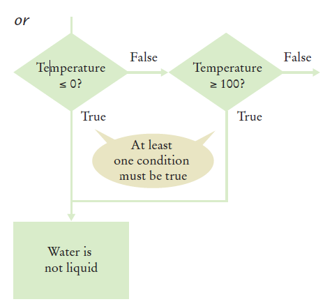

# Chapter Three: Decisions and Relational Operators

---

## Introduction

In this chapter, you will learn how to program simple and complex decisions. You will apply what you learn to the task of checking user input.

---

## Chapter Goals

In this chapter you will learn:

- To implement decisions using the `if` statement
- To compare integers, floating-point numbers, and strings using relational operators
- To write nested `if` statements for complex decision structures
- To use `elif` statements for multiple alternatives
- To write statements using the Boolean data type (`True`/`False`)
- To use **truthy** and **falsy** values in conditions
- To combine conditions using Boolean operators (`and`, `or`, `not`) and understand their **precedence**
- To use `pass` as a placeholder in a statement block
- To analyze strings using the `in` operator and string methods
- To validate user input and handle invalid data

---

[← Back to Course Index](../table-of-contents.md)

## 3.1 The `if` Statement

### What is an `if` Statement?

A computer program often needs to make decisions based on input or circumstances.

**Example:** Buildings often "skip" the 13th floor, and elevators should too. The labeled floor 14 is really physical floor 13. Any requested floor **above 13** is adjusted by subtracting 1.

```python
if floor > 13:
    actual_floor = floor - 1
```

The two keywords of the `if` statement are:

- `if`
- `else`

The `if` statement allows a program to carry out different actions depending on the nature of the data to be processed.

### Flowchart of the `if` Statement

One of the two branches is executed once:

- **True (`if`) branch** - executed when condition is true
- **False (`else`) branch** - executed when condition is false




### Flowchart with Only a True Branch

An `if` statement may not need a **False (`else`)** branch. Sometimes you only want to execute code when a condition is true, and do nothing otherwise.



```python
actual_floor = floor

if floor > 13:
    actual_floor = actual_floor - 1
```

### Syntax 3.1: The `if` Statement



### elevatorsim.py Example

```python
##
#  This program simulates an elevator panel that skips the 13th floor.
#

# Obtain the floor number from the user as an integer.
floor = int(input("Floor: "))

# Adjust floor if necessary.
if floor > 13:
    actual_floor = floor - 1
else:
    actual_floor = floor

# Print the result.
print("The elevator will travel to the actual floor", actual_floor)
```



### Example: Elevator Simulation

**Instructions:**

1. Open the file: `elevatorsim.py`
2. This is a slightly modified program
3. Run the program
4. Try a value that is less than 13 - what is the result?
5. Run the program again with a value that is greater than 13 - what is the result?
6. What happens if you enter 13?

### Compound Statements

Some constructs in Python are **compound statements**.

**Compound statements** span multiple lines and consist of a **header** and a **statement block**.

The `if` statement is an example of a compound statement.

**Key Rules:**

- Compound statements require a colon `:` at the end of the header
- The statement block is a group of one or more statements, all indented to the same column
- The statement block starts on the line after the header and ends at the first statement indented less than the first statement in the block
- If you use PyCharm, PyCharm properly indents the statement block automatically
- At the end of the block, enter a blank line and PyCharm will shift back to the first column

### Understanding Statement Blocks

- Statement blocks can be nested inside other types of blocks (we will learn about more blocks later)
- Statement blocks signal that one or more statements are part of a given compound statement
- In the case of the `if` construct, the statement block specifies:
  - The instructions that are executed if the condition is **true**
  - Or skipped if the condition is **false**
- Statement blocks are visual cues that allow you to follow the logic and flow of a program

### The `pass` Statement

Every statement block must contain **at least one statement**. If you do not have code to run yet, use `**pass`** — it does nothing, but it satisfies Python’s syntax:

```python
if floor == 13:
    pass   # placeholder: handle invalid floor later
else:
    print("We will move to the floor", floor)
    ...
```

You will see `pass` again with loops and functions when a block is required but empty for now.

### Tips on Indenting Blocks

Indentation Example

**Let PyCharm do the indenting for you!**

This is referred to as **"block structured"** code. Indenting consistently is not only syntactically required in Python, it also makes code much easier to follow.

### ⚠️ A Common Error: Avoid Duplication

**Avoid duplication in branches!**

If the same code is duplicated in each branch, then move it out of the `if` statement.

**Example:**

```python
# ❌ Bad - duplicated code
if condition:
    print("Processing...")
    result = value * 2
    print("Done")
else:
    print("Processing...")
    result = value * 3
    print("Done")

# ✅ Good - common code moved outside
print("Processing...")
if condition:
    result = value * 2
else:
    result = value * 3
print("Done")
```

### The Conditional Operator (Ternary Operator)

A "shortcut" you may find in existing code. **It is not used in this book.**

The shortcut notation can be used anywhere that a value is expected:

```python
# Conditional (ternary) operator syntax
value = x if condition else y
```

Conditional Operator Example
Conditional Operator Example 2

> **Note:** Complexity is BAD. This "shortcut" is difficult to read and a poor programming practice for beginners. Use regular `if-else` statements instead.

## 3.2 Relational Operators


| Operator | Meaning               |
| -------- | --------------------- |
| `>`      | greater than          |
| `<`      | less than             |
| `>=`     | greater than or equal |
| `<=`     | less than or equal    |
| `==`     | equal                 |
| `!=`     | not equal             |


Every `if` statement has a **condition** that usually compares two values with an operator.

**Relational Operators:**

```python
if floor > 13:    # Greater than
    ...

if floor >= 13:   # Greater than or equal to
    ...

if floor < 13:    # Less than
    ...

if floor <= 13:   # Less than or equal to
    ...

if floor == 13:   # Equal to
    ...

if floor != 13:   # Not equal to
    ...
```

### Assignment vs. Equality Testing

**Important distinction:**

- **Assignment (`=`):** Makes something true (assigns a value)
  ```python
  floor = 13  # Assigns the value 13 to floor
  ```
- **Equality testing (`==`):** Checks if something is true (compares values)
  ```python
  if floor == 13:  # Checks if floor equals 13
      print("You're on floor 13")
  ```

> **Common Error:** Using `=` instead of `==` in conditions will cause a syntax error or unexpected behavior!

### Comparing Strings

**Checking if two strings are equal:**

```python
if name1 == name2:
    print("The strings are identical")
```

**Checking if two strings are not equal:**

```python
if name1 != name2:
    print("The strings are not identical")
```

### String Equality Rules

**For two strings to be equal**, they must be:

- Of the **same length**
- Contain the **same sequence of characters** (case-sensitive)

String Equality Example 1

**If any character is different**, the two strings will not be equal:

String Equality Example 2

### Relational Operator Examples


| Expression      | Value   |
| --------------- | ------- |
| `3 > 4`         | `False` |
| `3 >= 4`        | `False` |
| `3 < 4`         | `True`  |
| `4 >= 4`        | `True`  |
| `3 == 4`        | `False` |
| `3 != 4`        | `True`  |
| `"hi" == "bye"` | `False` |
| `"hi" != "bye"` | `True`  |
| `"150" < "2"`   | `True`  |


The last row is a **string** comparison: characters are compared left to right using lexicographic (dictionary) order, not numeric value.

### Lexicographical Order

To compare strings in **dictionary-like order**:

```python
if string1 < string2:
    # string1 comes before string2 alphabetically
```

**Important Notes:**

- All **UPPERCASE** letters come before lowercase (e.g., "Z" < "a")
- **Space** comes before all other printable characters
- **Digits (0-9)** come before all letters
- Comparison is **case-sensitive**

### Example: Bookstore Sale

**Problem:** The university bookstore has a Kilobyte Day sale every October 24 (10.24), giving an 8 percent discount on all computer accessory purchases if the price is less than $128, and a 16 percent discount if the price is at least $128.

### Steps for Implementing an `if` Statement

**Step 1:** Decide on a branching condition

```
original price < 128 ?
```

**Step 2:** Write pseudocode for the true branch

```
discounted price = 0.92 x original price
```

**Step 3:** Write pseudocode for the false branch

```
discounted price = 0.84 x original price
```

**Step 4:** Double-check relational operators

- Test values **below, at, and above** the comparison (e.g., 127, 128, 129)

**Step 5:** Remove duplication

```
discounted price = --- x original price
```

**Step 6:** Test both branches

```
discounted price = 0.92 x 100 = 92
discounted price = 0.84 x 200 = 168
```

**Step 7:** Write the code in Python

```python
if original_price < 128:
    discount_rate = 0.92
else:
    discount_rate = 0.84

discounted_price = discount_rate * original_price
```

### The Sale Example

```python
##
#  Compute the discount for a given purchase.
#

# Obtain the original price.
original_price = float(input("Original price before discount: "))

# Determine the discount rate.
if original_price < 128:
    discount_rate = 0.92
else:
    discount_rate = 0.84

# Compute and print the discount.
discounted_price = discount_rate * original_price
print("Discounted price: %.2f" % discounted_price)
```

**Instructions:**

1. Open the file: `sale.py`
2. Run the program several times using different values:
  - Use values less than 128
  - Use values greater than 128
  - Enter 128 exactly
3. What results do you get?

## 3.3 Nested Branches

You can **nest** an `if` inside either branch of an `if` statement.

### Movie Ticket Example: Nested `if` Statements

This example demonstrates **nested decisions** by checking if a customer is a student, and then checking their age to determine the ticket price.

**Problem:** A movie theater offers different ticket prices:

- **Students**: $8 (regardless of age)
- **Non-students**: 
  - Children (under 12): $6
  - Adults (12 and over): $12

**Four possible outcomes:**

- Student → $8
- Non-student and age < 12 → $6
- Non-student and age >= 12 → $12

### Flowchart for the Movie Ticket Example

```
Ask if student
    ↓
Student? → Yes → Price = $8
    ↓
   No
    ↓
Ask for age
    ↓
Age < 12? → Yes → Price = $6
    ↓              ↓
   No              No
    ↓              ↓
Price = $12   Done
    ↓
   Done
```

### movie_ticket.py Example

```python
##
#  This program calculates movie ticket price based on student status and age.
#

# Ask if the customer is a student
is_student = input("Are you a student? (yes/no): ")

# Determine ticket price using nested if statements
if is_student.lower() == "yes":
    # Student price is always $8
    price = 8
    print("Student ticket price: $8")
else:
    # For non-students, check age
    age = int(input("Enter your age: "))
    
    if age < 12:
        price = 6
        print("Child ticket price: $6")
    else:
        price = 12
        print("Adult ticket price: $12")

print(f"Your total is: ${price}")
```

**Program Structure:**

- The **outer `if`** checks if the customer is a student
- The **inner `if`** (nested in the `else` branch) checks the age for non-students
- This creates **three possible paths** through the program

**How it works:**

1. First, we check if the customer is a student
2. If yes → set price to $8 (no need to check age)
3. If no → we need to check age to determine if it's a child or adult ticket

**Instructions:**

1. Run the program with different inputs:
  - Student: "yes" (should show $8)
  - Non-student, age 8: "no", then 8 (should show $6)
  - Non-student, age 15: "no", then 15 (should show $12)
2. Trace through the code to understand which branch executes for each input

## 3.4 Multiple Alternatives

### What if You Have More Than Two Branches?

Sometimes you need more than two alternatives. Count the branches for the following earthquake effect example:

- **8.0 or greater** - Most structures fall
- **7.0 to 7.99** - Many buildings destroyed
- **6.0 to 6.99** - Many buildings damaged, some collapse
- **4.5 to 5.99** - Damage to poorly constructed buildings
- **Less than 4.5** - No destruction of buildings

> **Important:** When using multiple `if` statements, test the **more specific conditions first**, then the general conditions.

Multiple Alternatives Example

### Flowchart of Multiway Branching



### The `elif` Statement

`elif` is short for **"Else, if..."**

**Key points:**

- As soon as one of the test conditions succeeds, the statement block is executed
- **No other tests are attempted** (this is different from multiple `if` statements)
- If none of the test conditions succeed, the final `else` clause is executed

### `if`, `elif` Multiway Branching

**Correct approach using `elif`:**

```python
if richter >= 8.0:    # Handle the 'special case' first
    print("Most structures fall")
elif richter >= 7.0:
    print("Many buildings destroyed")
elif richter >= 6.0:
    print("Many buildings damaged, some collapse")
elif richter >= 4.5:
    print("Damage to poorly constructed buildings")
else:      # so that the 'general case' can be handled last
    print("No destruction of buildings")
```

### ⚠️ What is Wrong With This Code?

**Incorrect approach using multiple `if` statements:**

```python
if richter >= 8.0: 
    print("Most structures fall")
if richter >= 7.0:
    print("Many buildings destroyed")
if richter >= 6.0:
    print("Many buildings damaged, some collapse")
if richter >= 4.5:
    print("Damage to poorly constructed buildings")
```

**Problem:** If `richter` is 8.5, **all four messages will print** because each `if` is evaluated independently! Use `elif` to ensure only one branch executes.

### Earthquake Example

**Instructions:**

1. Open the file: `earthquake.py`
2. Run the program with several different inputs
3. Test with values like 3.0, 5.0, 6.5, 7.5, 9.0

```python
##
#  This program prints a description of an earthquake, given the Richter scale
#  magnitude.
#

# Obtain the user input.
richter = float(input("Enter a magnitude on the Richter scale: "))

# Print the description
if richter >= 8.0:
    print("Most structures fall")
elif richter >= 7.0:
    print("Many buildings destroyed")
elif richter >= 6.0:
    print("Many buildings considerably damaged, some collapse")
elif richter >= 4.5:
    print("Damage to poorly constructed buildings")
else:
    print("No destruction of buildings")
```

## 3.5 Boolean Variables and Operators

### Boolean Variables

A **Boolean variable** is often called a **flag** because it can be either up (`True`) or down (`False`).

**Boolean** is a Python data type:

```python
failed = True
```

Boolean variables can be either `True` or `False`.

**Boolean operators** combine or invert conditions: `and`, `or`, and `not`.

### Truthy and Falsy Values

An `if` condition does not have to be a comparison. Python treats the value as **true** or **false** in a Boolean sense:

- **Truthy** — treated like `True` in a condition
- **Falsy** — treated like `False` in a condition

Common **falsy** values:


| Value               | Example in a condition |
| ------------------- | ---------------------- |
| `False`             | `if False:`            |
| `0`                 | `if 0:`                |
| `0.0`               | `if 0.0:`              |
| `""` (empty string) | `if "":`               |
| `None`              | `if None:`             |


Almost everything else is **truthy**, including non-zero numbers and non-empty strings.

**Checking that a string is not empty:**

```python
name = input("Name: ")

# Long form
if name != "":
    print("Hello,", name)

# Idiomatic Python — same idea
if name:
    print("Hello,", name)
```

**Caution:** `0` and `""` are falsy. That is useful for validation (`if score:` means “score is not zero”), but be careful not to reject `0` when zero is valid input.

You can inspect how Python classifies a value with `bool()`:

```python
print(bool(0))       # False
print(bool(42))      # True
print(bool(""))      # False
print(bool("hi"))    # True
```

### Combined Conditions: `and`

Combining two conditions is often used in **range checking** - is a value between two other values?

**Both sides of the `and` must be true** for the result to be true:

```python
if temp > 0 and temp < 100: 
    print("Liquid")
```

AND Operator Flowchart

### Combined Conditions: `or`

We use `or` if **only one of two conditions** needs to be true.

**If either condition is true, the result is true:**

```python
if temp <= 0 or temp >= 100:
    print("Not liquid")
```

OR Operator Flowchart

### The `not` Operator

If you need to invert a boolean variable or comparison, precede it with `not`.

**If you are using `not`, try to use simpler logic:**

```python
# Complex with not
if not attending or grade < 60: 
    print("Drop?")

# Better: avoid not when possible
if attending and not (grade < 60): 
    print("Stay")

# Best: use positive logic
if attending and grade >= 60:
    print("Stay")
```



### The `!=` Operator (Inequality)

A slightly different operator is used for checking **inequality** rather than negation.

**Example inequality:**
The password that the user entered is not equal to the password on file.

```python
if user_password != file_password:
    print("Passwords do not match")
```

> **Note:** Use `!=` for inequality checks, not `not ==`.

### `and` Flowchart

AND Flowchart

This is often called **"range checking"** - used to validate that the input is between two values:

```python
if temp > 0 and temp < 100:
    print("Liquid")
```

### `or` Flowchart



Another form of **"range checking"** - checks if value is **outside** a range:

```python
if temp <= 0 or temp >= 100:
    print("Not Liquid")
```


### Boolean Operator Examples

| Expression        | Value   |
| ----------------- | ------- |
| `True and True`   | `True`  |
| `True and False`  | `False` |
| `False and True`  | `False` |
| `False and False` | `False` |
| `True or True`    | `True`  |
| `True or False`   | `True`  |
| `False or True`   | `True`  |
| `False or False`  | `False` |
| `not True`        | `False` |
| `not False`       | `True`  |


### Boolean Operator Precedence

When one condition mixes `not`, `and`, and `or`, Python applies them in this order (highest to lowest):

| Order | Operator | Meaning |
| ----- | -------- | ------- |
| 1 | `not` | negation first |
| 2 | `and` | then `and` |
| 3 | `or` | then `or` |

**Example:** test whether `x` and `y` have the **same sign** (both positive or both negative):

```python
if (x > 0 and y > 0) or (x < 0 and y < 0):
    print("The numbers have the same sign")
```

Parentheses make the intent obvious. Without them, Python still groups the same way because `and` binds tighter than `or`:

```python
# Same meaning — and is evaluated before or
if x > 0 and y > 0 or x < 0 and y < 0:
    ...
```

**Another example** — “not attending **or** grade below 60”:

```python
if not attending or grade < 60:
    print("Drop?")
```

Here `not attending` is evaluated first, then the `or`.

When a condition is hard to read, **add parentheses** even if they are not required.


### Comparison Example

**Instructions:**

1. Open the file: `compare2.py`
2. Run the program with several inputs
3. Test different combinations of conditions (same sign, opposite signs, and two floats that are almost equal)

```python
##
#  This program demonstrates comparisons of numbers, using Boolean expressions.
#

x = float(input("Enter a number (such as 3.5 or 4.5): "))
y = float(input("Enter a second number: "))

if x == y:
    print("They are the same.")
else:
    if x > y:
        print("The first number is larger")
    else:
        print("The first number is smaller")

    if -0.01 < x - y and x - y < 0.01:
        print("The numbers are close together")

    if (x > 0 and y > 0) or (x < 0 and y < 0):
        print("The numbers have the same sign")
    else:
        print("The numbers have different signs")
```


### ⚠️ Common Errors with Boolean Conditions

**Confusing `and` and `or` Conditions**

It is a surprisingly common error to confuse `and` and `or` conditions.

**Remember:**

- A value lies **between** 0 and 100 if it is at least 0 **and** at most 100
- It lies **outside** that range if it is less than 0 **or** greater than 100

There is no golden rule; you just have to think carefully about what you're trying to check.

### Short-Circuit Evaluation: `and`

Combined conditions are evaluated **from left to right**.

**If the left half of an `and` condition is false, why look further?**

```python
if temp > 0 and temp < 100: 
    print("Liquid")
```

If `temp > 0` is `False`, Python doesn't evaluate `temp < 100` because the entire expression must be `False`.

### Short-Circuit Evaluation: `or`

**If the left half of the `or` is true, why look further?**

```python
if temp <= 0 or temp >= 100: 
    print("Not Liquid")
```

If `temp <= 0` is `True`, Python doesn't evaluate `temp >= 100` because the entire expression must be `True`.

### De Morgan's Law

**De Morgan's law** tells you how to negate `and` and `or` conditions:

- `not(A and B)` is the same as `not A or not B`
- `not(A or B)` is the same as `not A and not B`

**Example:** Shipping is higher to AK and HI

To simplify conditions with negations of `and` or `or` expressions, it's a good idea to apply De Morgan's law to move the negations to the innermost level.

**Two equivalent ways to write the same condition:**

```python
# Method 1: Using != (not equal)
if (country != "USA" 
    and state != "AK" 
    and state != "HI"):
    shipping_charge = 20.00

# Method 2: Using not with == (De Morgan's law)
if not(country == "USA"
       or state == "AK"
       or state == "HI"):
    shipping_charge = 20.00
```

## 3.6 Analyzing Strings

### The `in` Operator

Sometimes it's necessary to analyze or ask certain questions about a particular string.

Sometimes it is necessary to determine if a string contains a given substring. That is, one string contains an exact match of another string.

**Example:**

```python
name = "John Wayne"

# Check if substring exists
if "Way" in name:
    print("Found 'Way' in the name")
```

The expression `"Way" in name` yields `True` because the substring "Way" occurs within the string stored in variable `name`.

The `not in` operator is the inverse of the `in` operator:

```python
if "Smith" not in name:
    print("'Smith' is not in the name")
```

### Substring: Suffixes

Suppose you are given the name of a file and need to ensure that it has the correct extension:

```python
if filename.endswith(".html"):
    print("This is an HTML file.")
```

The `endswith()` string method is applied to the string stored in `filename` and returns `True` if the string ends with the substring ".html" and `False` otherwise.

### Operations for Testing Substrings


| Operator / method   | Description                                                  |
| ------------------- | ------------------------------------------------------------ |
| `sub in s`          | `True` if `sub` appears anywhere in `s`                      |
| `sub not in s`      | `True` if `sub` does not appear in `s`                       |
| `s.startswith(sub)` | `True` if `s` begins with `sub`                              |
| `s.endswith(sub)`   | `True` if `s` ends with `sub`                                |
| `s.find(sub)`       | Index of the first occurrence of `sub`, or `-1` if not found |
| `s.count(sub)`      | Number of non-overlapping occurrences of `sub`               |


### Methods: Testing String Characteristics


| Method        | Description                                    | Example           | Result |
| ------------- | ---------------------------------------------- | ----------------- | ------ |
| `s.isalpha()` | `True` if every character is a letter          | `"abc".isalpha()` | `True` |
| `s.isdigit()` | `True` if every character is a digit           | `"123".isdigit()` | `True` |
| `s.isalnum()` | `True` if every character is a letter or digit | `"a1".isalnum()`  | `True` |
| `s.islower()` | `True` if all cased letters are lowercase      | `"hi".islower()`  | `True` |
| `s.isupper()` | `True` if all cased letters are uppercase      | `"HI".isupper()`  | `True` |


See Chapter 2 for other string methods such as `upper()`, `lower()`, `strip()`, and `replace()`.

### Comparing and Analyzing Strings

Relational operators work on strings as well as numbers. Two strings are **equal** (`==`) only if they have the same length and the same characters (case-sensitive). Ordering operators (`<`, `<=`, `>`, `>=`) compare strings **lexicographically** (character by character, like dictionary order).


| Operator                | Meaning (strings)                |
| ----------------------- | -------------------------------- |
| `==`                    | same sequence of characters      |
| `!=`                    | different sequences              |
| `<`, `>`, `<=`, `>=tru` | lexicographic (dictionary) order |


### Substring Example

**Instructions:**

1. Open the file: `substrings.py`
2. Run the program and test several strings and substrings
3. Try different combinations of strings and substrings

```python
##
#  This program demonstrates the various string methods that test substrings.
#

# Obtain a string and substring from the user.
the_string = input("Enter a string: ")
the_sub_string = input("Enter a substring: ")

if the_sub_string in the_string:
    print("The string does contain the substring.")

    how_many = the_string.count(the_sub_string)
    print("   It contains", how_many, "instance(s)")

    where = the_string.find(the_sub_string)
    print("   The first occurrence starts at position", where)

    if the_string.startswith(the_sub_string):
        print("   The string starts with the substring.")
    else:
        print("   The string does not start with the substring.")

    if the_string.endswith(the_sub_string):
        print("   The string ends with the substring.")
    else:
        print("   The string does not end with the substring.")

else:
    print("The string does not contain the substring.")
```

## 3.7 Application: Input Validation

### Why Input Validation?

Accepting user input is dangerous! Users can enter invalid data.

**Consider the Elevator program:**

- Assume that the elevator panel has buttons labeled 1 through 20 (but not 13)

### Illegal Inputs

The following are illegal inputs:

1. **The number 13** (no 13th floor)
  ```python
   if floor == 13:
       print("Error: There is no thirteenth floor.")
  ```
2. **Zero or a negative number**
3. **A number larger than 20**
  ```python
   if floor <= 0 or floor > 20:
       print("Error: The floor must be between 1 and 20.")
  ```
4. **An input that is not a sequence of digits** (e.g., "five" instead of 5)

> **Note:** Python's exception mechanism is needed to help verify integer and floating point values (covered in Chapter 7).

### elevatorsim2.py Example

```python
##
#  This program simulates an elevator panel that skips the 13th floor,
#  checking for input errors.
#

# Obtain the floor number from the user as an integer.
floor = int(input("Floor: "))

# Make sure the user input is valid.
if floor == 13:
    print("Error: There is no thirteenth floor.")
elif floor <= 0 or floor > 20:
    print("Error: The floor must be between 1 and 20.")
else:
    # Now we know that the input is valid
    actual_floor = floor
    if floor > 13:
        actual_floor = floor - 1

    print("The elevator will travel to the actual floor", actual_floor)
```

**Instructions:**

1. Open the file: `elevatorsim2.py`
2. Test the program with a range of inputs including:
  - Valid inputs: 1, 12, 14, 20
  - Invalid inputs: -1, 0, 13, 21, 25
  - Non-numeric inputs: "five", "abc"

---

## Key Takeaways

1. **Decision-making** is fundamental to programming - use `if`, `elif`, and `else` to control program flow
2. **Relational operators** allow you to compare values and make decisions based on comparisons
3. **Nested `if` statements** enable complex decision structures with multiple levels
4. **Boolean operators** (`and`, `or`, `not`) combine conditions for sophisticated logic; precedence is `not`, then `and`, then `or` — use parentheses when mixing them
5. **Truthy and falsy** values let you write conditions like `if name:` instead of `if name != ""` — watch out for `0` and empty strings
6. **`pass`** is a no-op placeholder when a block must exist but has no code yet
7. **String analysis** using the `in` operator and string methods helps validate and process text data
8. **Input validation** is essential - always check user input before using it in your program
9. **Short-circuit evaluation** makes Boolean expressions efficient - Python stops evaluating as soon as the result is determined

---

*End of Chapter Three*

[← Back to Course Index](../table-of-contents.md)