# Chapter Four: Loops

---

## Introduction

In this chapter, you will learn about loop statements in Python and how to use them when a program must repeat steps over and over.

---

## Chapter Goals

In this chapter you will learn:

- To implement `while` and `for` loops
- To hand-trace the execution of a program
- To become familiar with common loop algorithms
- To understand nested loops

---

[← Back to Course Index](../table-of-contents.md)

## 4.1 The `while` Loop

### What is a `while` Loop?

A loop executes instructions repeatedly while a condition is `True`.

**Examples of loop applications:**
- Calculating compound interest
- Repeating a prompt until the user enters valid input
- Drawing tiles
- Processing a set of items (for example, the characters in a string or numbers read from the user)

### Planning the `while` Loop

Suppose you are calculating compound interest: you start with a balance, earn interest each year, and add it to the balance. **How many years does it take for the balance to reach a target amount?**

```python
balance = 10.0
target = 100.0
year = 0
rate = 2.5

while balance < target:
    year += 1
    interest = balance * rate / 100
    balance += interest
```

### Syntax 4.1: The `while` Statement

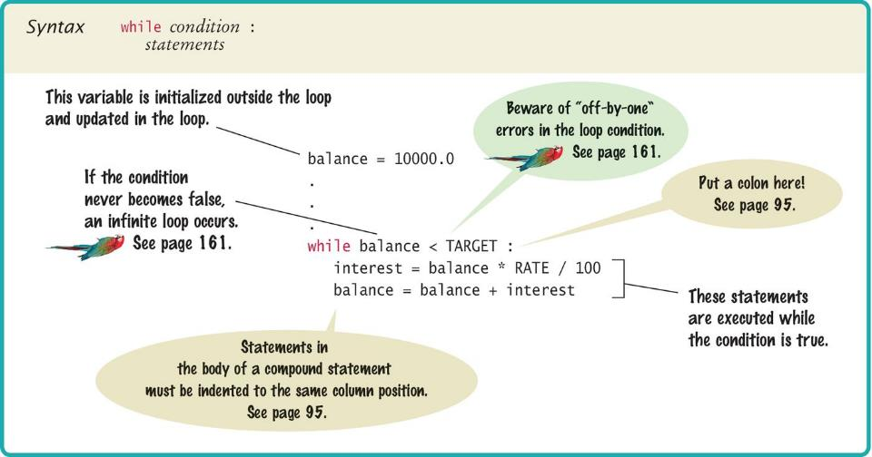

### Count-Controlled Loops

A `while` loop that is controlled by a counter:

```python
counter = 1                 # Initialize the counter

while counter <= 10:       # Check the counter
    print(counter)
    counter += 1           # Update the loop variable
```

### Event-Controlled Loops

A `while` loop that is controlled by an **event** (something that happens during the program), not a fixed counter. The loop runs until the balance reaches a target — the same compound-interest idea as the planning example:

```python
balance = INITIAL_BALANCE
target = TARGET
year = 0
rate = RATE

while balance < target:              # event: balance reaches target
    year += 1
    interest = balance * rate / 100
    balance += interest                # update the variable used in the test
```

### Execution of the Loop

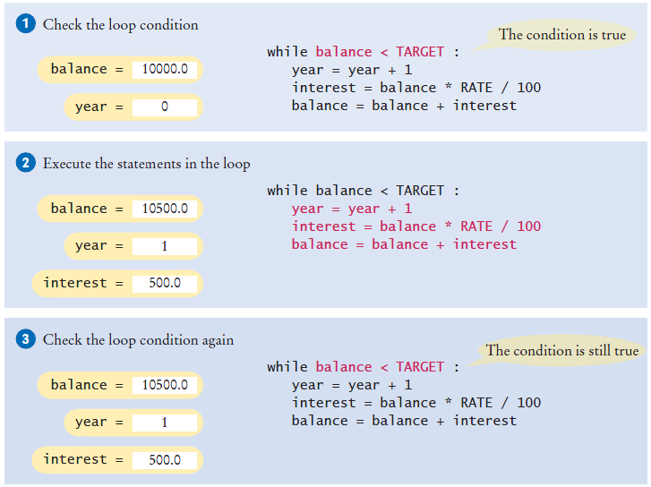

")

### doubleinv.py Example

```python
##
#  This program computes the time required to double an investment.
#

# Create constant variables.
RATE = 5.0
INITIAL_BALANCE = 10000.0
TARGET = 2 * INITIAL_BALANCE

# Initialize variables used with the loop.
balance = INITIAL_BALANCE
year = 0

# Count the years required for the investment to double.
while balance < TARGET:
   year += 1
   interest = balance * RATE / 100
   balance += interest

# Print the results.
print(f"The investment doubled after {year} years.")
```

**Key points:**
- Declare and initialize a variable outside of the loop to count `year`
- Increment the `year` variable each time through

### Lab: Doubling an Investment (`doubleinv.py`)

**Instructions:**
1. Review the **doubleinv.py Example** code above
2. Type it into your environment (or run it if your tool supports code blocks) — it uses fixed constants (`RATE = 5.0`, `INITIAL_BALANCE = 10000.0`) and does not prompt for input
3. Confirm the output reports how many years it takes for the balance to double at 5% annual interest
4. Change `RATE` or `INITIAL_BALANCE`, run again, and compare the results

### ⚠️ Common Error: Incorrect Test Condition

The loop body will only execute if the test condition is `True`.

If `bal` is initialized as less than the `TARGET` and should grow until it reaches `TARGET`, which version will execute the loop body?

```python
# ✅ Correct - executes when balance is less than target
while bal < TARGET:
    year += 1
    interest = bal * RATE / 100
    bal += interest

# ❌ Incorrect - would never execute if balance starts below target
while bal >= TARGET:
    year += 1
    interest = bal * RATE / 100
    bal += interest
```

### ⚠️ Common Error: Infinite Loops

The loop body will execute until the test condition becomes `False`.

**What if you forget to update the test variable?**

`bal` is the test variable (`TARGET` doesn't change). You will loop forever! (or until you stop the program)

```python
# ❌ Infinite loop - bal is never updated!
while bal < TARGET:
    year += 1
    interest = bal * RATE / 100
    # Missing: bal += interest
```

### ⚠️ Common Error: Off-by-One Errors

A counter variable is often used in the test condition.

Your counter can start at 0 or 1, but programmers often start a counter at 0.

**If I want to paint all 5 fingers on one hand, when am I done?**

- If you start at 0, use `<`
- If you start at 1, use `<=`

**Example starting at 0:**
```python
finger = 0
FINGERS = 5

while finger < FINGERS:
    # paint finger
    finger += 1
# Values: 0, 1, 2, 3, 4 (5 iterations)
```

**Example starting at 1:**
```python
finger = 1
FINGERS = 5

while finger <= FINGERS:
    # paint finger
    finger += 1
# Values: 1, 2, 3, 4, 5 (5 iterations)
```

### Updating Variables in a Loop (`+=`)

In Chapter 2 you learned **augmented assignment** operators such as `+=`. Inside loops they are very common, because the same variable is updated on every iteration:

```python
year += 1           # same as year = year + 1
total += salary     # same as total = total + salary
balance += interest
counter += 1
```

The behavior is the same as writing `variable = variable + value`; the shorter form is easier to read when the loop body repeats the same update pattern.

### `break`, `continue`, and `while True`

Sometimes you need to change how a loop runs without rewriting the whole condition.

- **`break`** exits the loop immediately and continues with the first statement **after** the loop.
- **`continue`** skips the rest of the **current** iteration and goes back to test the loop condition again.
- **`while True:`** repeats the loop body until a **`break`** runs. Python has no “do-while” loop; `while True` plus `break` is a common way to run at least once and exit from the middle of the body.

**Prompt until valid input (`while True` + `break`):**

```python
while True:
    value = int(input("Enter a positive value < 100: "))
    if value > 0 and value < 100:
        break
    print("Invalid input.")
```

**Skip values that should not be counted (`continue`):**

```python
total = 0.0
input_str = input("Enter value (blank to quit): ")

while input_str != "":
    value = float(input_str)
    if value <= 0:
        input_str = input("Enter value (blank to quit): ")
        continue
    total += value
    input_str = input("Enter value (blank to quit): ")
```

**Find the first digit with `break` (compare to the `found` flag pattern in Section 4.7):**

```python
position = 0
while position < len(string):
    if string[position].isdigit():
        print("First digit at position", position)
        break
    position += 1
else:
    print("The string does not contain a digit.")
```

> **Note:** The optional `else` on a `while` or `for` loop runs only if the loop finishes **without** hitting `break`.

### `while` Loop Examples

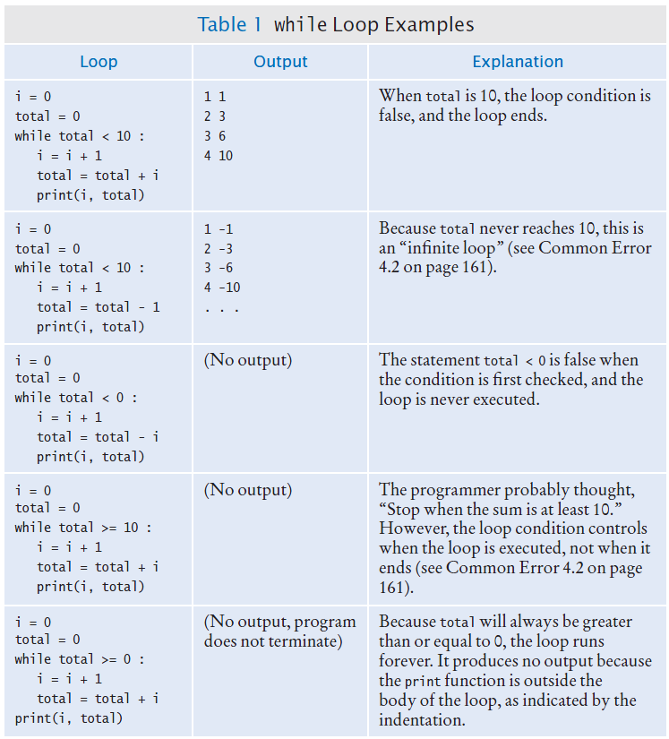

## 4.2 Problem Solving: Hand-Tracing

**Why learn hand-tracing?** Hand-tracing means simulating a program on paper, step by step, by writing down how key variables change. It helps you understand exactly how a loop runs (which values the variables take each time), find logic errors (e.g., off-by-one or wrong conditions) without running the code, and predict the output. When a program does not behave as expected, hand-tracing the loop is a reliable way to see where the logic goes wrong.

### Hand-Tracing Loops

**Example:** Calculate the sum of digits of a number (1729 → 1+7+2+9)

**Steps:**
1. Make columns for key variables (n, total, digit)
2. Examine the code and number the steps
3. Set variables to state before loop begins

**Program to trace** (uses `%` and `//` from Chapter 2 to peel off the rightmost digit each time):

```python
n = int(input("Enter a positive integer: "))
total = 0

while n > 0:
    digit = n % 10       # rightmost digit (e.g., 1729 % 10 → 9)
    total += digit
    n = n // 10            # drop that digit (e.g., 1729 // 10 → 172)

print("Sum of digits:", total)
```

For input `1729`, the loop adds 9, then 2, then 7, then 1, and prints `19`.

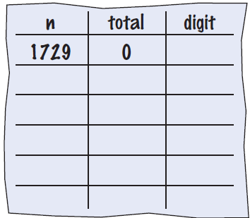

### Tracing Sum of Digits: Getting Started

- Start executing loop body statements, changing variable values on a new line
- Cross out values in previous line

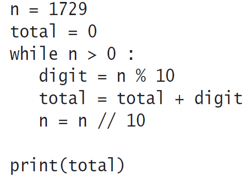


- Continue executing loop statements, changing variables
- `1729 // 10` leaves `172` (integer division drops the last digit)

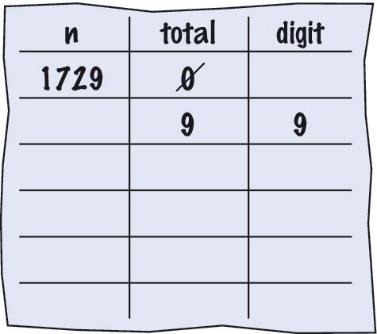

### Tracing Sum of Digits: Later Iterations

Test condition. If `True`, execute loop again.

Variable `n` is 172. Is 172 > 0? `True`!

Make a new line for the second time through and update variables.

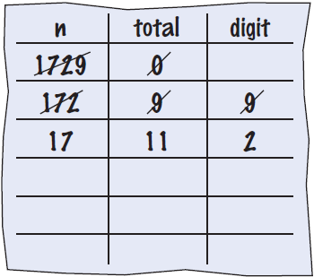

Third time through:

Variable `n` is 17, which is still greater than 0.

Execute loop statements and update variables.

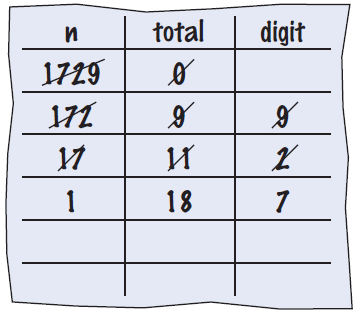

Fourth loop iteration:

Variable `n` is 1 at start of loop. 1 > 0? `True`

Executes loop and changes variable `n` to `0` (`1 // 10 == 0`)

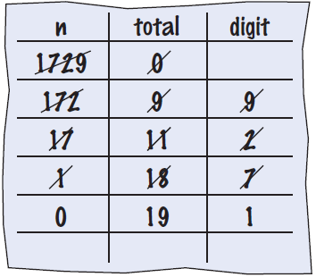

### Tracing Sum of Digits (Final)

Because `n` is 0, the expression `(n > 0)` is `False`.

Loop body is not executed.

Jumps to next statement after the loop body.

Finally prints the sum!

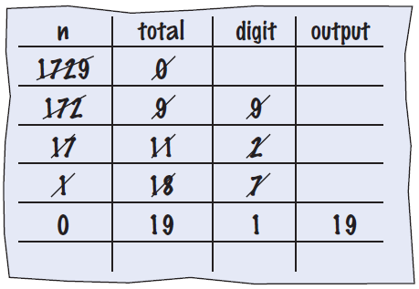

## 4.3 Application: Processing Sentinel Values

### Processing Sentinel Values

**Sentinel values** are often used when you don't know how many values the user will enter. Use a special character or value to signal the "last" item.

For numeric input of positive numbers, it is common to use the value `-1`.

A sentinel value denotes the end of a data set, but it is **not part of the data**.

In the pattern below, **`-1`** signals the end of input: the **`while salary >= 0`** test stops the loop when `-1` is read, and the **`if salary >= 0.0`** inside the body ensures `-1` is never added to `total` or `count`.

```python
total = 0.0
count = 0
salary = 0.0   # any value >= 0 so the loop runs at least once

while salary >= 0:
    salary = float(input("Enter a salary or -1 to finish: "))
    if salary >= 0.0:          # do not count the sentinel (-1)
        total += salary
        count += 1
```

**Why `while salary >= 0` instead of `while salary != -1`?**

The sentinel is **`-1`**, but the loop condition is **`salary >= 0`** on purpose:

1. **`salary` is initialized to `0.0`** (not a sentinel) so the loop is guaranteed to run at least once and prompt for input.
2. Each time through, the program **reads** a new `salary`. Valid data (0 or positive) keeps the condition `True` and the loop continues.
3. When the user enters **`-1`**, `salary >= 0` becomes `False`, the loop **ends**, and `-1` is **not** added to `total` or `count` because of the **`if salary >= 0.0`** guard inside the body.

So the sentinel ends the loop via the **`while`** test; the **`if`** makes sure the sentinel is never treated as data. You could write `while salary != -1` only if you read `salary` before the loop (a **priming read**); both styles are common.

### Averaging a Set of Values

**Algorithm:**
1. Declare and initialize a `total` variable to 0
2. Declare and initialize a `count` variable to 0
3. Declare and initialize a `salary` variable to 0 (or use a priming read)
4. Prompt user with instructions
5. Loop while the last value read is not the sentinel (here: `while salary >= 0`, which becomes `False` when the user enters `-1`)
6. Save entered value to input variable (`salary`)
7. If salary is not -1 or less (sentinel value):
   - Add salary variable to total variable
   - Add 1 to count variable
8. Make sure you have at least one entry before you divide!
9. Divide total by count and output
10. Done!

### sentinel.py Example

```python
##
#  This program prints the average of salary values that are terminated with
#  a sentinel.
#

# Initialize variables to maintain the running total and count.
total = 0.0
count = 0

# Initialize salary to any non-sentinel value.
salary = 0.0

# Process data until the sentinel is entered.
while salary >= 0.0:
   salary = float(input("Enter a salary or -1 to finish: "))
   if salary >= 0.0:
      total += salary
      count += 1

# Compute and print the average salary.
if count > 0:
   average = total / count
   print(f"Average salary is {average}")
else:
   print("No data was entered.")
```

**Key points:**
- Outside the `while` loop: declare and initialize variables to use
- Input new `salary` and compare to sentinel; update running `total` and `count` only for non-sentinel values
- Since `salary` is initialized to 0, the `while` loop statements will execute at least once
- Prevent divide by zero; calculate and output the average using `total` and `count`

### Sentinel Example

**Instructions:**
1. Review the **sentinel.py Example** code above
2. Notice the use of the `if` test inside the `while` loop
3. The `if` checks to make sure we are not processing the sentinel value

### Priming Read

Some programmers don't like the "trick" of initializing the input variable with a value other than a sentinel.

```python
# Set salary to a value to ensure that the loop
# executes at least once.
salary = 0.0

while salary >= 0:
    salary = float(input("Enter a salary or -1 to finish: "))
```

### Modification Read

An alternative is to change the variable with a read before the loop.

The input operation at the bottom of the loop is used to obtain the next input.

```python
total = 0.0
count = 0

# Priming read
salary = float(input("Enter a salary or -1 to finish: "))

while salary >= 0.0:
    total += salary
    count += 1

    # Modification read
    salary = float(input("Enter a salary or -1 to finish: "))
```

### Boolean Variables and Sentinels

A boolean variable can be used to control a loop. Sometimes called a **flag** variable.

```python
total = 0.0
count = 0
done = False

while not done:
    value = float(input("Enter a salary or -1 to finish: "))

    if value < 0.0:
        done = True
    else:
        # Process value
        total += value
        count += 1
```

**Key points:**
- Initialize `done` so that the loop will execute
- Set `done` flag to `True` if sentinel value is found

## 4.4 Common Loop Algorithms

### Common Loop Algorithms

- Sum and Average Value
- Counting Matches
- Prompting until a Match Is Found
- Maximum and Minimum

### Average Example

```python
total = 0.0
count = 0

input_str = input("Enter value: ")

while input_str != "":
    value = float(input_str)
    total += value
    count += 1
    input_str = input("Enter value: ")

if count > 0:
    average = total / count
else:
    average = 0.0
```

**Average of Values:**
- First total the values
- Initialize `count` to 0
- Increment per input
- Check for `count` 0 before divide!

### Sum Example

**Sum of Values:**
- Initialize total to 0
- Use `while` loop with sentinel

```python
total = 0.0

input_str = input("Enter value: ")

while input_str != "":
    value = float(input_str)
    total += value
    input_str = input("Enter value: ")
```

### Counting Matches (e.g., Negative Numbers)

```python
negatives = 0

input_str = input("Enter value: ")

while input_str != "":
    value = int(input_str)
    
    if value < 0:
        negatives += 1
    
    input_str = input("Enter value: ")

print("There were", negatives, "negative values.")
```

**Counting Matches:**
- Initialize `negatives` to 0
- Use a `while` loop
- Add to `negatives` per match


### Prompt Until a Match is Found

**Algorithm:**
1. Initialize boolean flag `valid` to `False`
2. Loop while the flag is still `False` (`while not valid`)
3. Read input and test whether it is in the allowed range
4. If input is valid, set the flag to `True` so the loop stops
5. Otherwise, print an error message and try again

```python
valid = False

while not valid:
    value = int(input("Please enter a positive value < 100: "))
    
    if value > 0 and value < 100:
        valid = True
    else:
        print("Invalid input.")
```

> **Note:** This is an excellent way to validate user-provided inputs. The same idea appears in Section 4.1 with **`while True`** and **`break`** instead of a flag variable.

### Maximum

**Algorithm:**
1. Get first input value
2. By definition, this is the largest that you have seen so far
3. Loop while you have a valid number (non-sentinel)
4. Get another input value
5. Compare new input to largest (or smallest)
6. Update largest if necessary

```python
largest = int(input("Enter a value: "))

input_str = input("Enter a value: ")

while input_str != "":
    value = int(input_str)
    
    if value > largest:
        largest = value
    
    input_str = input("Enter a value: ")
```

### Minimum

**Algorithm:**
1. Get first input value
2. This is the smallest that you have seen so far!
3. Loop while you have a valid number (non-sentinel)
4. Get another input value
5. Compare new input to largest (or smallest)
6. Update smallest if necessary

```python
smallest = int(input("Enter a value: "))

input_str = input("Enter a value: ")

while input_str != "":
    value = int(input_str)
    
    if value < smallest:
        smallest = value
    
    input_str = input("Enter a value: ")
```

### Grades Example

```python
##
#  This program computes information related to a sequence of grades obtained
#  from the user. It computes the number of passing and failing grades,
#  computes the average grade and finds the highest and lowest grade.
#

# Initialize the counter variables.
num_passing = 0
num_failing = 0

# Initialize the variables used to compute the average.
total = 0
count = 0

# Initialize the min and max variables.
min_grade = 100.0        # Assuming 100 is the highest grade possible.
max_grade = 0.0

# Use a while loop with a priming read to obtain the grades.
grade = float(input("Enter a grade or -1 to finish: "))
while grade >= 0.0:
   # Increment the passing or failing counter.
   if grade >= 60.0:
      num_passing += 1
   else:
      num_failing += 1

   # Determine if the grade is the min or max grade.
   if grade < min_grade:
      min_grade = grade
   if grade > max_grade:
      max_grade = grade

   # Add the grade to the running total.
   total += grade
   count += 1

   # Read the next grade.
   grade = float(input("Enter a grade or -1 to finish: "))

# Print the results.
if count > 0:
   average = total / count
   print(f"The average grade is {average:.2f}")
   print(f"Number of passing grades is {num_passing}")
   print(f"Number of failing grades is {num_failing}")
   print(f"The maximum grade is {max_grade:.2f}")
   print(f"The minimum grade is {min_grade:.2f}")
```

**Instructions:**
1. Review the **Grades Example** code above
2. Look carefully at the source — it combines several loop algorithms from this section
3. Grades are read with a **priming read** and a `while` loop; enter **`-1`** to finish
4. A grade of **60.0 or higher** counts as passing (fixed cutoff, not a percentage of a maximum score)
5. The program tracks passing and failing counts, running total, average, and minimum and maximum grade
6. Run the program with a mix of grades (for example 55, 72, 88, 40) and then `-1`; check that the summary matches your expectations

## 4.5 The `for` Loop

### What is a `for` Loop?

**Uses of a `for` loop:**
- The `for` loop can be used to iterate over the contents of any **container**
- A **container** is an object (like a **string**) that contains or stores a collection of elements
- A **string** is a container that stores the collection of characters in the string

### An Example of a `for` Loop

**While version:**

```python
state_name = "Virginia"
i = 0
while i < len(state_name):
   letter = state_name[i]
   print(letter)
   i += 1
```

**For version:**

```python
state_name = "Virginia"
for letter in state_name:
   print(letter)
```

The loop variable (`letter`) takes each character from the string in order. You do not need an index or `range` unless you also need the position.

**Important difference between the `while` loop and the `for` loop:**
- In the `while` loop, the **index variable** `i` is assigned 0, 1, and so on
- In the `for` loop, the **element variable** is assigned `state_name[0]`, `state_name[1]`, and so on

### When to Use `while` vs `for`

| Prefer **`for`** when… | Prefer **`while`** when… |
|------------------------|---------------------------|
| You are iterating over a **string** (or other container you will see later) | The number of repetitions is **not known** ahead of time |
| You know how many times to run (`range`, fixed count) | The loop should stop on an **event** (sentinel, target reached, match found) |
| You want each **element** directly (`for letter in name`) | You are updating several variables and the stop condition is a **general test** |

**Rule of thumb:** If you can say “for each item in …” or “for each number from a to b,” use `for`. If you can only say “keep going while …,” use `while`.

### The `for` Loop (Count-Controlled)

**Uses of a `for` loop:**
- A `for` loop can also be used as a count-controlled loop that iterates over a range of integer values

```python
# while version
i = 1
while i < 10:
    print(i)
    i += 1

# for version
for i in range(1, 10):
    print(i)
```

### Syntax of a `for` Statement (Container)

Using a `for` loop to iterate over the contents of a container, an element at a time.

")

### Syntax of a `for` Statement (Range)

You can use a `for` loop as a count-controlled loop to iterate over a range of integer values.

We use the `range` function for generating a sequence of integers that can be used with the `for` loop.

")

### Forms of `range`

`range` can be called in three ways:

| Call | Values produced (first … last) |
|------|----------------------------------|
| `range(stop)` | `0, 1, …, stop - 1` |
| `range(start, stop)` | `start, start + 1, …, stop - 1` (stop is **not** included) |
| `range(start, stop, step)` | start, start + step, … while still before stop |

```python
# range(stop) — often used for "repeat n times" with i = 0, 1, ..., n-1
for i in range(5):
    print(i)                 # 0 1 2 3 4

# range(start, stop) — same idea as while i < stop starting at start
for i in range(1, 10):
    print(i)                 # 1 2 3 4 5 6 7 8 9

# range(start, stop, step) — count by step; negative step counts down
for i in range(10, 0, -1):
    print(i)                 # 10 9 8 7 6 5 4 3 2 1
```

If `step` is negative, `stop` must be **less than** `start` so the sequence moves toward `stop`.

### Good Examples of `for` Loops

Keep the loops simple!

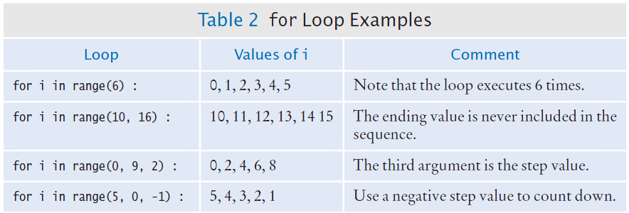

### Investment Growth Table

```python
##
#  This program prints a table showing the growth of an investment.
#

# Define constant variables.
RATE = 5.0
INITIAL_BALANCE = 10000.0

# Obtain the number of years for the computation.
num_years = int(input("Enter number of years: "))

# Print the table of balances for each year.
balance = INITIAL_BALANCE
for year in range(1, num_years + 1):
   interest = balance * RATE / 100
   balance += interest
   print(f"{year:4d} {balance:10.2f}")
```

### Steps to Writing a Loop

**Planning:**
1. Decide what work to do inside the loop
2. Specify the loop condition
3. Determine loop type
4. Set up variables before the first loop
5. Process results when the loop is finished
6. Trace the loop with typical examples

**Coding:**
1. Implement the loop in Python

### A Special Form of the `print` Function

Python provides a special form of the `print` function that does not start a new line after the arguments are displayed.

This is used when we want to print items on the same line using multiple `print` statements.

**Example:**
```python
print("00", end="")
print(3 + 4)
```

**Output:**
```
007
```

Including `end=""` as the last argument to the `print` function prints an empty string after the arguments, instead of a new line.

The output of the next `print` function starts on the same line.

## 4.6 Nested Loops

### Loops Inside of Loops

In Chapter Three we learned how to nest `if` statements to allow us to make complex decisions.

Remember that to nest the `if` statements we need to indent the code block.

Complex problems sometimes require a **nested loop**, one loop nested inside another loop.

The nested loop will be indented inside the code block of the first loop.

A good example of using nested loops is when you are processing cells in a table:
- The outer loop iterates over all of the rows in the table
- The inner loop processes the columns in the current row

### Our Example Problem Statement

Print a **10 by 10 multiplication table**: rows and columns from 1 to 10, with each cell showing the product of its row and column.

**Key idea:** Use an outer loop for the rows (1 to 10) and an inner loop for the columns (1 to 10). For each cell, print `row * column`.

```python
##
#  This program prints a 10 by 10 multiplication table.
#

for row in range(1, 11):
    for col in range(1, 11):
        print(row * col, end="\t")
    print()
```

- The **outer loop** runs once per row (`row` = 1, 2, …, 10).
- The **inner loop** runs once per column in that row (`col` = 1, 2, …, 10).
- `print(row * col, end="\t")` prints each product followed by a tab; `print()` with no arguments starts a new line after each row.

**Sample output (first few rows):**

```
1	2	3	4	5	6	7	8	9	10
2	4	6	8	10	12	14	16	18	20
3	6	9	12	15	18	21	24	27	30
...
```

## 4.7 Processing Strings

### Processing Strings

A common use of loops is to process or evaluate strings.

For example, you may need to count the number of occurrences of one or more characters in a string or verify that the contents of a string meet certain criteria.

### String Processing Examples

- Counting Matches
- Finding All Matches
- Finding the First or Last Match

### Counting Matches

Suppose you need to count the number of uppercase letters contained in a string.

We can use a `for` loop to check each character in the string to see if it is uppercase.

The loop below sets the variable `char` equal to each successive character in the string.

Each pass through the loop tests the next character in the string to see if it is uppercase.

```python
string = "Hello, World!"
uppercase = 0

for char in string:
    if char.isupper():
        uppercase += 1
```

### Counting Vowels

Suppose you need to count the vowels within a string.

We can use a `for` loop to check each character in the string to see if it is in the string of vowels "aeiou".

The loop below sets the variable `char` equal to each successive character in the string.

Each pass through the loop tests the lowercase of the next character in the string to see if it is in the string "aeiou".

```python
word = input("Enter a word: ")
vowels = 0

for char in word:
    if char.lower() in "aeiou":
        vowels += 1
```

### Finding All Matches Example

When you need to examine every character in a string, independent of its position, we can use a `for` statement to examine each character.

If we need to print the position of each uppercase letter in a sentence, we can test each character in the string and print the position of all uppercase characters.

We set the range to be the length of the string.

We test each character. If it is uppercase, we print `i`, its position in the string.

```python
sentence = input("Enter a sentence: ")

for i in range(len(sentence)):
    if sentence[i].isupper():
        print(i)
```

### Finding the First Match

This example finds the position of the first digit in a string.

```python
string = input("Enter a string: ")
found = False
position = 0

while not found and position < len(string):
    if string[position].isdigit():
        found = True
    else:
        position += 1

if found:
    print("First digit occurs at position", position)
else:
    print("The string does not contain a digit.")
```

### Finding the Last Match

Here is a loop that finds the position of the last digit in a string.

This approach uses a `while` loop to start at the last character and move toward the start. Set `position` to `len(string) - 1`. If the character at `position` is not a digit, decrease `position` by 1 and repeat until you find a digit or run out of characters.

```python
string = input("Enter a string: ")
found = False
position = len(string) - 1

while not found and position >= 0:
    if string[position].isdigit():
        found = True
    else:
        position -= 1

if found:
    print("Last digit occurs at position", position)
else:
    print("The string does not contain a digit.")
```

---

## Key Takeaways

1. **Loops** allow programs to execute instructions repeatedly until a task is finished or a collection is fully processed
2. **`while` loops** test their condition **before** each iteration (pre-test); use them when repetition depends on an event or unknown count
3. **`for` loops** iterate over strings (character by character) or over integers from **`range`**
4. **`+=`** and similar operators are the usual way to update counters and totals inside a loop body
5. **`break`**, **`continue`**, and **`while True`** control loop exit and skipping without changing the overall algorithm
6. **`range(stop)`**, **`range(start, stop)`**, and **`range(start, stop, step)`** define which integers a count-controlled `for` loop visits
7. **Sentinel values** signal the end of data input when the number of items is unknown
8. **Common loop algorithms** include summing, averaging, counting matches, and finding maximum/minimum values
9. **Nested loops** allow processing of two-dimensional data structures like tables
10. **String processing** with loops enables character-by-character analysis and validation
11. **Hand-tracing** (for example sum of digits with `%` and `//`) helps understand loop execution and debug logic errors
12. **Common errors** include infinite loops, off-by-one errors, and incorrect test conditions

---

*End of Chapter Four*

[← Back to Course Index](../table-of-contents.md)
