# Chapter 8: Sets and Dictionaries

---

## Introduction

In this chapter you will learn how to work with two more types of containers—**sets** and **dictionaries**—as well as how to combine containers to model complex structures. Sets store unique values and support fast membership tests and mathematical set operations. Dictionaries store key–value associations for efficient lookups. Both are essential for real-world data processing.

---

## Chapter Goals

In this chapter you will learn:

- To build and use a set container
- To learn common set operations for processing data
- To build and use a dictionary container
- To work with a dictionary for table lookups
- To work with complex data structures
- To split a program into modules

---

[← Back to Course Index](../table-of-contents.md)

## Contents

- Sets (8.1)
- Dictionaries (8.2)
- Complex Structures (8.3)
- Modules (8.4)

---

## 8.1 Sets

A **set** is a container that stores a collection of **unique values**.

- Unlike a list, the elements (members) of a set are **not stored in any particular order** and **cannot be accessed by position**.
- Operations match the operations on sets in mathematics (union, intersection, difference, etc.).
- Because sets do not need to maintain order, set operations are much faster than the equivalent list operations.

### Example Set

The following example uses three sets of colors—the colors of the British, Canadian, and Italian flags. In each set, the order does not matter, and the colors are not duplicated.


### Creating and Using Sets

To create a set with initial elements, specify the elements enclosed in **braces** `{}`, as in mathematics:

```python
cast = {"Luigi", "Gumbys", "Spiny"}
```

Alternatively, use the **`set()`** function to convert any sequence (e.g., a list) into a set:

```python
names = ["Luigi", "Gumbys", "Spiny"]
cast = set(names)
```

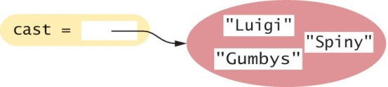

Set elements must be **hashable** (immutable and suitable for use as dictionary keys). You can put numbers, strings, and tuples in a set, but not lists or dictionaries—those are mutable and unhashable. If you try `my_set = {[1, 2]}` you will get a `TypeError`.

### Creating an Empty Set

For historical reasons, you **cannot** use `{}` to make an empty set in Python (that creates an empty dictionary). Instead, use **`set()`** with no arguments:

```python
cast = set()
numberOfCharacters = len(cast)   # In this case it's zero
```

")

As with any container, use the **`len()`** function to obtain the number of elements in a set.

### Set Membership: `in`

To determine whether an element is in the set, use the **`in`** operator or its inverse, **`not in`**:

```python
if "Luigi" in cast:
    print("Luigi is a character in Monty Python's Flying Circus.")
else:
    print("Luigi is not a character in the show.")
```

### Accessing Set Elements

Because sets are **unordered**, you cannot access elements by position as with a list. Use a **`for`** loop to iterate over the elements:

```python
print("The cast of characters includes:")
for character in cast:
    print(character)
```

Note: the order in which elements are visited depends on internal storage, not on the order in which they were added.

**Example output:**

```
The cast of characters includes:
Gumbys
Spiny
Luigi
```

The order in the output may differ from the order in which the set was created.

### Displaying Sets in Sorted Order

Use the **`sorted()`** function, which returns a **list** (not a set) of the elements in sorted order:

```python
for actor in sorted(cast):
    print(actor)
```

### Adding Elements

Sets are **mutable**. Add elements with the **`add()`** method:

```python
cast = set(["Luigi", "Gumbys", "Spiny"])   # 1
cast.add("Arthur")                          # 2  Arthur is added
cast.add("Spiny")                           # 3  Spiny is already in the set; no effect
```

- If the element is not in the set, it is added and the size increases by one.
- If the element is already in the set, there is no effect.

### Removing Elements: `discard()`

The **`discard()`** method removes an element if it exists. It has **no effect** if the element is not in the set:

```python
cast.discard("Arthur")        # Removes Arthur
cast.discard("The Colonel")  # Has no effect; no exception
```

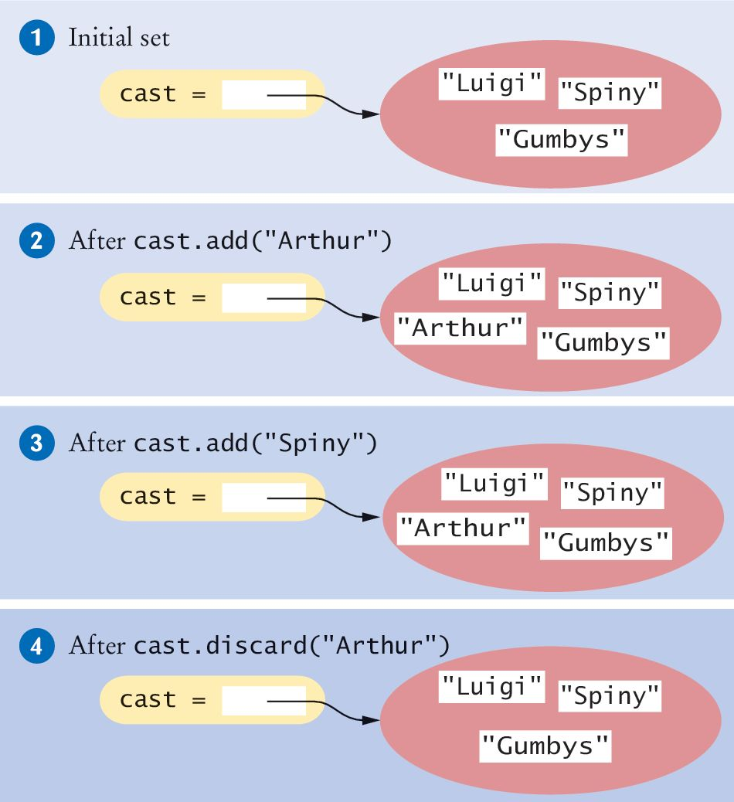

### Removing Elements: `remove()`

The **`remove()`** method removes an element if it exists, but **raises an exception** if the element is not in the set. For this course we use **`discard()`** to avoid exceptions.

```python
cast.remove("The Colonel")   # Raises KeyError if "The Colonel" not in set
```

### Removing Elements: `clear()`

The **`clear()`** method removes **all** elements, leaving an empty set:

```python
cast.clear()   # cast now has size 0
```

### Subsets

A set is a **subset** of another set **if and only if** every element of the first set is also an element of the second set. In the figure below, the Canadian flag colors are a subset of the British colors; the Italian flag colors are not.

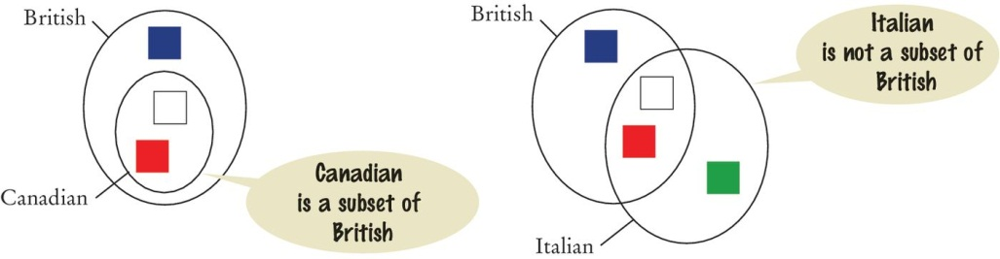

### The `issubset()` Method

**`issubset()`** returns `True` or `False`:

```python
canadian = {"Red", "White"}
british = {"Red", "Blue", "White"}
italian = {"Red", "White", "Green"}

if canadian.issubset(british):
    print("All Canadian flag colors occur in the British flag.")   # True

if not italian.issubset(british):
    print("At least one of the colors in the Italian flag does not occur in the British flag.")   # True
```

### Set Equality and Inequality

Use `==` and `!=` to test set equality. Two sets are equal **if and only if** they have exactly the same elements:

```python
french = {"Red", "White", "Blue"}
if british == french:
    print("The British and French flags use the same colors.")
```

### Set Union: `union()`

The **union** of two sets contains all elements from both sets, with duplicates removed. Both British and Italian sets contain Red and White, but the union has only one instance of each color.

```python
# inEither: {"Blue", "Green", "White", "Red"}
inEither = british.union(italian)
```

**Note:** `union()` returns a **new** set; it does not modify either original set.

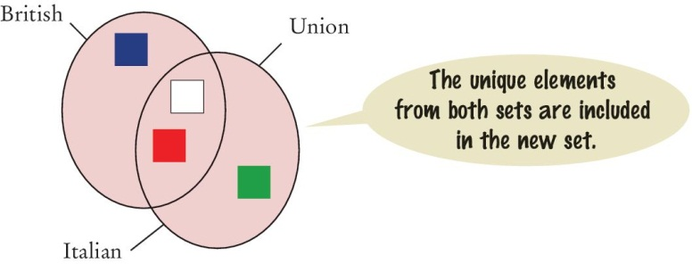

### Set Intersection: `intersection()`

The **intersection** of two sets contains all elements that are in **both** sets:

```python
# inBoth: {"White", "Red"}
inBoth = british.intersection(italian)
```

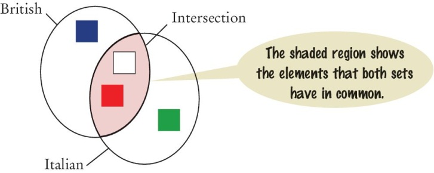

### Difference of Two Sets: `difference()`

The **difference** of two sets is a new set containing elements that are in the first set but **not** in the second:

```python
print("Colors that are in the Italian flag but not the British:")
print(italian.difference(british))   # Prints {'Green'}
```

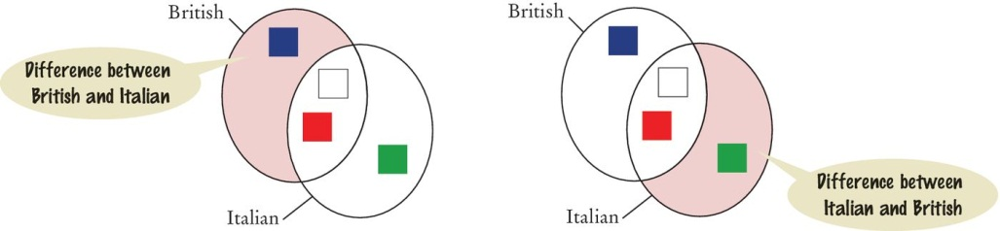

### Common Set Operations Summary

Remember: **`union()`**, **`intersection()`**, and **`difference()`** return new sets; they do **not** modify the sets they are called on.

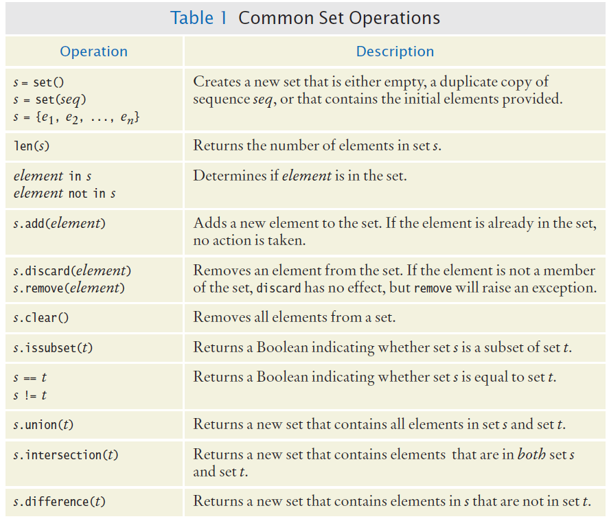

### Programming Tip

When you manage a collection of **unique** items, **sets are far more efficient than lists**. Some programmers use lists and write:

```python
if item not in itemList:
    itemList.append(item)
```

instead of:

```python
itemSet.add(item)
```

The set-based version is much faster—often by a factor of more than 10.

---

## Counting Unique Words

### Problem Statement

We want to count the number of **unique words** in a text document. For example, "Mary had a little lamb" has 5 unique words. Our task is to write a program that reads a text document and reports how many unique words it contains.

### Step 1: Understand the Task

- We must detect whether a word has been seen earlier; only the first occurrence counts.
- Reading each word and adding it to a **set** ensures duplicates are automatically ignored.
- After processing every word, the **size of the set** is the number of unique words.

### Step 2: Decompose the Problem

1. Create an empty set.
2. For each word in the document, add the word to the set.
3. The number of unique words is the size of the set.

Standard set operations (create, add, `len`) and file reading can be combined.

### Step 3: Build the Set

We need to read individual words from the file. For simplicity we use a literal file name. We also need to **clean** words (remove non-letters and normalize capitalization) before adding them to the set.

```python
with open("nurseryrhyme.txt", "r") as inputFile:
    for line in inputFile:
        theWords = line.split()
        for word in theWords:
            # Clean word and add to set
            pass
```

nurseryrhyme.txt

```text
Mary had a little lamb,
whose fleece was white as snow.

And everywhere that Mary went,
the lamb was sure to go.

It followed her to school one day
which was against the rules.

It made the children laugh and play,
to see a lamb at school.

And so the teacher turned it out,
but still it lingered near,

And waited patiently about,
till Mary did appear.

"Why does the lamb love Mary so?"
the eager children cry.

"Why, Mary loves the lamb, you know."
 the teacher did reply.
```

### Step 4: Clean the Words

Strip non-letters and convert to lowercase by iterating over the string and building a new string from alphabetic characters:

```python
def clean(string):
    result = ""
    for char in string:
        if char.isalpha():
            result = result + char.lower()
    return result
```

### Step 5: Assembly

Implement `main()` and combine with the cleaning logic. Open the file `countwords.py` to see the full program.

```python
##
#  This program counts the number of unique words contained in a text document.
#

def main():
   uniqueWords = set()

   filename = input("Enter filename (default: nurseryrhyme.txt): ")
   if len(filename) == 0:
      filename = "nurseryrhyme.txt"

   with open(filename, "r") as inputFile:
      for line in inputFile:
         theWords = line.split()
         for word in theWords:
            cleaned = clean(word)
            if cleaned != "":
               uniqueWords.add(cleaned)

   print("The document contains", len(uniqueWords), "unique words.")

## Cleans a string by making letters lowercase and removing characters
#  that are not letters.
#  @param string the string to be cleaned
#  @return the cleaned string
#
def clean(string):
   result = ""
   for char in string:
      if char.isalpha():
         result = result + char.lower()

   return result

# Start the program.
main()
```

---

## 8.2 Dictionaries

A **dictionary** is a container that keeps **associations between keys and values**.

- Every key has an associated value.
- **Keys are unique**; a value may be associated with several keys.
- Access is by key, not by position.

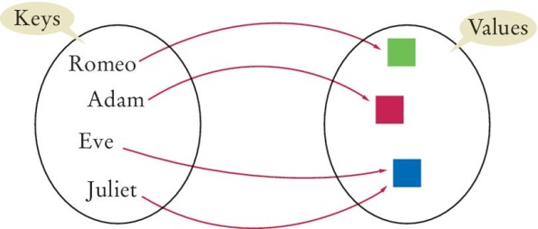

### Syntax: Sets and Dictionaries

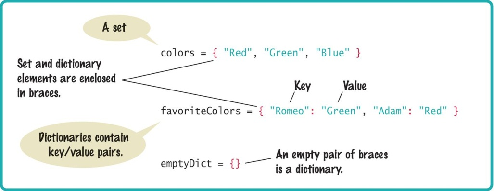

### Creating Dictionaries

Example: look up a phone number by name. Use a dictionary with names as **keys** and phone numbers as **values**:

```python
contacts = {"Fred": 7235591, "Mary": 3841212, "Bob": 3841212, "Sarah": 2213278}
```

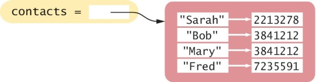

Dictionary **keys** must be **hashable** (e.g. numbers, strings, tuples—not lists or dicts). **Values** can be any type. This restriction is the same as for set elements and allows fast lookup by key.

### Duplicating Dictionaries: `dict()`

Create a copy of a dictionary with **`dict()`**:

```python
oldContacts = dict(contacts)
```

### Accessing Dictionary Values: `[]`

Use the **subscript operator `[]`** with a key to get the value. The key must exist, or a **`KeyError`** is raised:

```python
print("Fred's number is", contacts["Fred"])   # prints 7235591
```

A dictionary is not a sequence; you cannot access items by index or position—only by key.

### Dictionary Length: `len()`

As with lists and sets, use **`len()`** to get the number of key–value pairs:

```python
contacts = {"Fred": 7235591, "Mary": 3841212, "Bob": 3841212, "Sarah": 2213278}
print(len(contacts))   # 4
```

### Checking Membership

Use **`in`** (or **`not in`**) to test whether a key is in the dictionary:

```python
if "John" in contacts:
    print("John's number is", contacts["John"])
else:
    print("John is not in my contact list.")
```

### Default Values: `get()`

To use a **default value** when a key is missing, use **`get(key, default)`**:

```python
number = contacts.get("Fred", 0)
print("Dial", number)
```

If `"Fred"` is not in `contacts`, `0` is returned. Use a default that matches the value type (e.g., a number when values are numbers) so that later code does not mix types.

### Adding and Modifying Items

Dictionaries are **mutable**. Use **`[]`** to add a new key–value pair or to change the value for an existing key:

```python
contacts["John"] = 4578102   # 1  Add John
contacts["John"] = 2228102   # 2  Update John's number
```

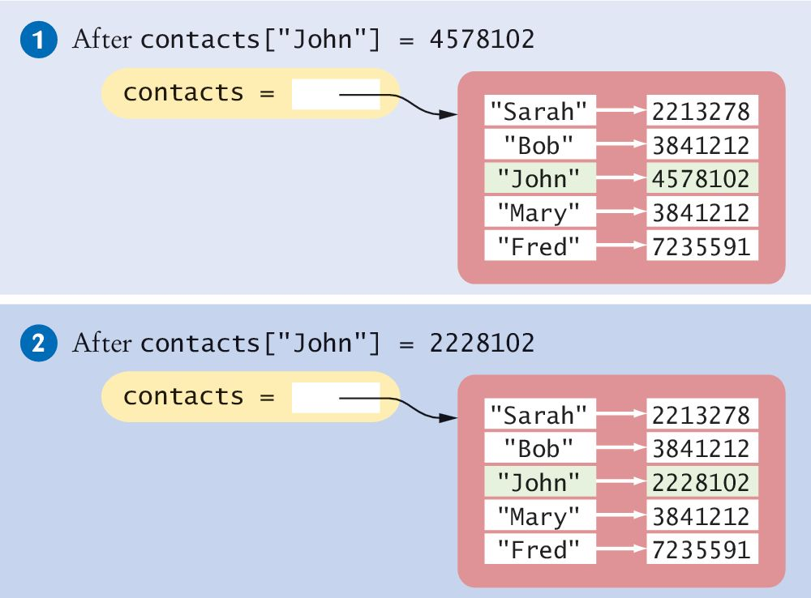

### Adding New Elements Dynamically

You can start with an empty dictionary and add items as needed:

```python
favoriteColors = {}
favoriteColors["Juliet"] = "Blue"
favoriteColors["Adam"] = "Red"
favoriteColors["Eve"] = "Blue"
favoriteColors["Romeo"] = "Green"
```

### Removing Elements: `pop()`

**`pop(key)`** removes the item with the given key (both key and value) and returns the value. If the key is not present, it raises **`KeyError`**. You can pass a second argument **`pop(key, default)`** to return that default instead of raising when the key is missing:

```python
contacts = {"Fred": 7235591, "Mary": 3841212, "Bob": 3841212, "Sarah": 2213278}
contacts.pop("Fred")
```

")

To avoid an exception, either check for the key first or use a default:

```python
if "Fred" in contacts:
    contacts.pop("Fred")
# Or: contacts.pop("Fred", None)  # returns None if key missing, no exception
```

### Storing the Removed Value

**`pop()`** returns the value of the removed item, so you can store it:

```python
fredsNumber = contacts.pop("Fred")
```

### Removing All Elements: `clear()`

**`clear()`** removes **all** items, leaving an empty dictionary:

```python
contacts.clear()   # contacts is now {}
print(len(contacts))   # 0
```

### Traversing a Dictionary

Iterate over the **keys** with a **`for`** loop. In **Python 3.7 and later**, dictionaries maintain **insertion order**, so keys are visited in the order they were first added.

```python
contacts = {"Fred": 7235591, "Mary": 3841212, "Bob": 3841212, "Sarah": 2213278}
contacts["John"] = 4578102

print("My Contacts:")
for key in contacts:
    print(key)
```

**Example output** (insertion order: Fred → Mary → Bob → Sarah → John):

```
My Contacts:
Fred
Mary
Bob
Sarah
John
```

You can iterate over just the keys with **`keys()`** or just the values with **`values()`** when you need only one part of the dictionary:

```python
for name in contacts.keys():
    print(name)
for number in contacts.values():
    print(number)
```

### Traversing in Sorted Order

Use **`sorted(contacts)`** to iterate over keys in sorted order and print key–value pairs:

```python
print("My Contacts:")
for key in sorted(contacts):
    print("%-10s %d" % (key, contacts[key]))
```

**Example output** (alphabetical by name):

```
My Contacts:
Bob        3841212
Fred       7235591
John       4578102
Mary       3841212
Sarah      2213278
```

### Iterating More Efficiently: `items()`

**`items()`** returns key–value pairs (as tuples). This is often more efficient than iterating keys and then looking up each value. The idiomatic way is to **unpack** each pair into two variables:

```python
for key, value in contacts.items():
    print(key, value)
```

You can also write `for item in contacts.items():` and use `item[0]` and `item[1]`, but unpacking is clearer and preferred.

### Storing Data Records

Data records with multiple fields are common. Storing fields in a list forces you to remember indices; using a **dictionary** with field names as keys is clearer and less error-prone.

### Dictionaries as Data Records

Use one dictionary per record: keys are field names, values are the data. Example—a student record:

```python
record = {"id": 100, "name": "Sally Roberts", "class": 2, "gpa": 3.78}
```

### Extracting Records from a File

Define a function that reads one line, splits it (e.g., by colon), and returns a dictionary. Example file format:

```
USA:331002651
Canada:37742154
India:1380004385
China:1393409038
Australia:25499884
```

```python
def extractRecord(infile):
    record = {}
    line = infile.readline()
    if line != "":
        fields = line.split(":")
        record["country"] = fields[0]
        record["population"] = int(fields[1])
    return record
```

The returned `record` has keys `"country"` and `"population"`. To print all records:

```python
infile = open("populations.txt", "r")
record = extractRecord(infile)
while len(record) > 0:
    print(f"{record['country']} {record['population']:10}")
    record = extractRecord(infile)
```

### Common Dictionary Operations Summary

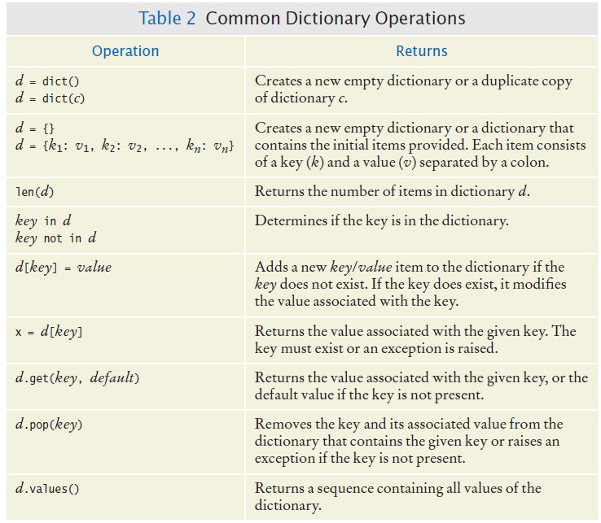

---

## 8.3 Complex Structures

Containers can hold any type of data, including other containers. Some problems require **complex structures** that combine lists, sets, and dictionaries.

### A Dictionary of Sets: Book Index

A book index lists the pages on which each term appears. We can build an index from a file with lines like:

```
6:type
7:example
7:index
7:program
8:type
10:example
11:program
20:set
```

Each line gives a page number and a term. If a term appears on the same page more than once, the page should still be listed only once.

**Desired output** (terms in alphabetical order, pages separated by commas):

```
example: 7, 10
index: 7
program: 7, 11
set: 20
type: 6, 8
```

### Why a Dictionary of Sets?

- **Terms must be unique** → use each term as a dictionary key.
- **Output in alphabetical order** → iterate over sorted keys.
- **No duplicate page numbers per term** → use a **set** of page numbers as the value for each term.

So: **dictionary**: key = term, value = **set** of page numbers.

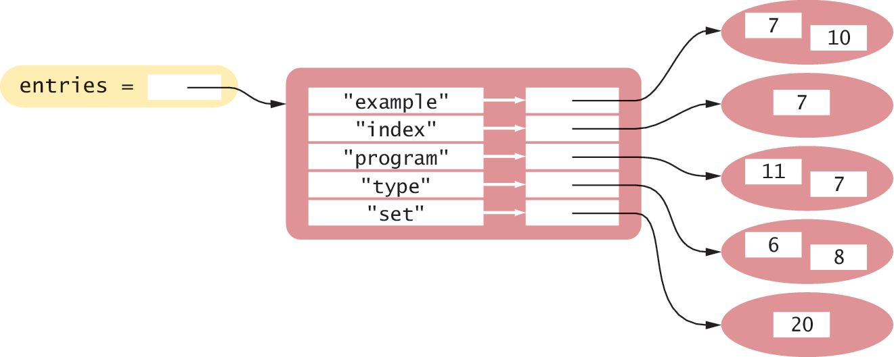

### Buildindex.py

The program `buildindex.py` implements this. Open the files to see the full code.

```python
##
#  This program builds the index of a book from terms and page numbers.
#

def main():
   # Create an empty dictionary.
   indexEntries = {}

   # Extract the data from the text file.
   infile = open("indexdata.txt", "r")
   fields = extractRecord(infile)
   while len(fields) > 0:
      addWord(indexEntries, fields[1], fields[0])
      fields = extractRecord(infile)

   infile.close()

   # Print the index listing.
   printIndex(indexEntries)

## Extract a single record from the input file.
#  @param infile the input file object
#  @return a list containing the page number and term or an empty list if
#  the end of file was reached
#
def extractRecord(infile):
   line = infile.readline()
   if line != "":
      fields = line.split(":")
      page = int(fields[0])
      term = fields[1].rstrip()
      return [page, term]
   else:
      return []

## Add a word and its page number to the index.
#  @param entries the dictionary of index entries
#  @param term the term to be added to the index
#  @param page the page number for this occurrence of the term
#
def addWord(entries, term, page):
   # If the term is already in the dictionary, add the page to the set.
   if term in entries:
      pageSet = entries[term]
      pageSet.add(page)

   # Otherwise, create a new set that contains the page and add an entry.
   else:
      pageSet = set([page])
      entries[term] = pageSet

## Print the index listing.
#  @param entries a dictionary containing the entries of the index
#
def printIndex(entries):
   for key in sorted(entries):
      print(key, end=" ")
      pageSet = entries[key]
      first = True
      for page in sorted(pageSet):
         if first:
            print(page, end="")
            first = False
         else:
            print(",", page, end="")

      print()

# Start the program.
main()
```

---

## 8.4 Modules

Splitting programs into multiple source files makes large or team projects manageable.

### What Is a Module?

- Small programs can live in a single file.
- Larger programs or team projects benefit from splitting code into separate source files—each file is a **module**.

### Reasons for Using Modules

- **Manageability:** Hundreds of functions in one file are hard to manage and debug. Grouping related functions in separate files makes testing and debugging easier.
- **Collaboration:** Multiple programmers can work on different files; each person can own a distinct set of modules.

### Typical Division

Large Python programs often have:

- A **driver module** that contains **`main()`** (or the first executable statements).
- One or more **supplemental modules** with supporting functions and constants.

### Modules Example

**Supplemental module** `math_utils.py`:

```python
# math_utils.py
# Supplemental Module

def add(a, b):
    return a + b

def subtract(a, b):
    return a - b
```

**Driver module** `main.py`:

```python
# main.py
# Driver Module

import math_utils

def main():
    num1, num2 = 10, 5
    print("Addition:", math_utils.add(num1, num2))
    print("Subtraction:", math_utils.subtract(num1, num2))

if __name__ == "__main__":
    main()
```

The line **`if __name__ == "__main__":`** means: run the block below only when this file is **executed directly** (e.g. `python main.py`), not when it is **imported** as a module. When another file does `import main`, Python sets `__name__` to `"main"`, so `main()` is not called automatically. That way the file can be both a runnable script and a reusable module.

Place both `math_utils.py` and `main.py` in the same folder.

---

## Review

### Python Sets

- A set stores a collection of **unique** values.
- Create with set literals `{}` or **`set()`**.
- **`in`** tests membership.
- **`add()`** adds elements; **`discard()`** removes (no exception if missing).
- **`issubset()`** tests subset relationship.
- **`union()`**, **`intersection()`**, **`difference()`** return new sets; originals are unchanged.
- Sets are implemented for fast membership and set operations.

### Python Dictionaries

- A dictionary keeps **key–value** associations.
- Use **`[]`** to access or set values by key.
- **`len()`** returns the number of key–value pairs.
- **`in`** tests whether a key exists.
- **`get(key, default)`** returns a default if the key is missing.
- **`pop(key)`** removes an entry and returns its value.
- **`clear()`** removes all entries.

### Complex Structures

- Complex structures (e.g., dictionary of sets) help organize data for real-world problems.
- Large programs are often split across multiple modules for clarity and teamwork.
